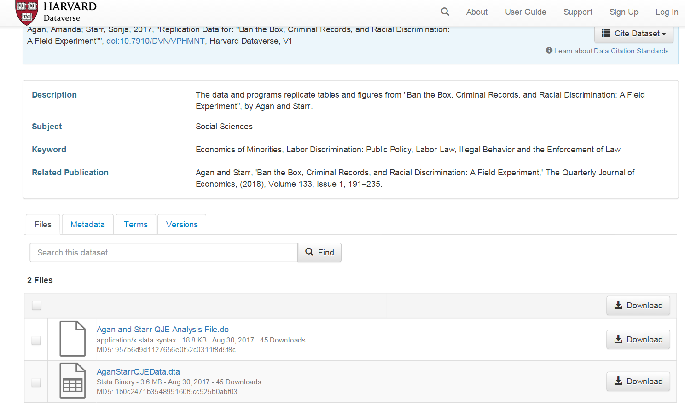
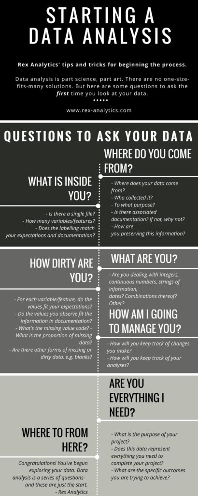
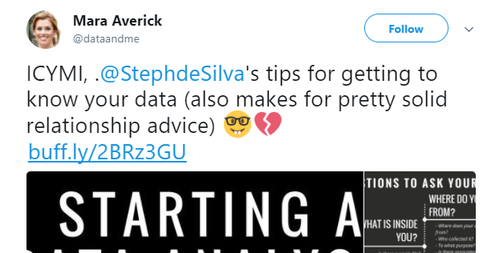
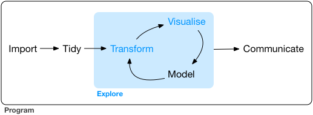

## La causalidad en las ciencias sociales

En la sesión de hoy repasaremos temas que probablemente ya habéis explorado en cursos anteriores sobre métodos de investigación, concretamente la causalidad. Se trata de un concepto fundamental en la investigación empírica. A menudo investigamos porque queremos hacer inferencias causales. Queremos estar en condiciones de determinar si una intervención o un proceso social están causalmente relacionados con la delincuencia o con algún otro resultado criminológico relevante.

Hacer inferencias causales a menudo implica hacer comparaciones. Por ejemplo, entre casos que han sido objeto de una intervención y casos que no han sido objeto del proceso causal que estamos tratando de investigar. Pero ya deberías saber que no todos los tipos de comparaciones de investigación son iguales. En cursos anteriores sobre métodos, seguramente habrás discutido las diferencias entre los estudios experimentales y los estudios observacionales. Estos diferentes tipos de diseños de investigación influyen en tu capacidad para hacer inferencias causales.

Pensemos en un caso concreto para que esto tenga más sentido. ¿Existe discriminación contra los exdelincuentes en el mercado laboral? En otras palabras, ¿los delincuentes tienen menos probabilidades de encontrar empleo después de su puesta en libertad debido a los prejuicios de los empleadores? ¿O podemos decir que el hecho de que los exdelincuentes tengan menos probabilidades de encontrar empleo puede deberse a otros factores? Quizás tengan menos cualificaciones. Quizás tengan menos capital social, menos personas que conozcan y que puedan ayudarles a conseguir trabajo o a informarse sobre oportunidades laborales. ¿Quizás están menos interesados en encontrar empleo?

Solo en comparaciones en las que todas las demás variables son iguales se pueden hacer inferencias causales. Solo sería justo comparar a John, un exdelincuente con un título de secundaria, X número de contactos personales y Y número de experiencia profesional, con Peter, un no delincuente, con las mismas credenciales educativas y profesionales que John (y con todas las demás variables que importan a la hora de conseguir un trabajo también iguales entre Peter y John).

¿Cómo se puede hacer eso? ¿Cómo se pueden crear situaciones en las que el resto de factores sean iguales? Bueno, eso es lo que se enseña en los cursos de diseño de investigaciones. Lo importante es recordar que la forma en que se generan los datos, la forma en que se realiza el estudio, afectará, por supuesto, al tipo de interpretaciones que se hagan a partir de las comparaciones estadísticas. Y no todos los estudios son iguales. Algunos diseños de investigación te colocan en una mejor posición que otros para hacer inferencias causales.

A estas alturas ya deberías saber que el estándar "bronce" (https://link.springer.com/article/10.1007/s11292-005-3538-2) para establecer la causalidad en las ciencias sociales es el experimento aleatorio. En un ensayo aleatorio, los investigadores cambian la variable causal de interés para un grupo utilizando algo parecido a un lanzamiento de moneda. Como destacan Angrist y Pischke (2015: xiii):

*"Al cambiar las circunstancias de forma aleatoria, hacemos que sea muy probable que la variable de interés no esté relacionada con los muchos otros factores que determinan los resultados que queremos estudiar... La manipulación aleatoria hace que, en promedio, las demás variables sean iguales en los grupos que experimentaron la manipulación y en los que no"*.

Supongamos que deseas determinar si detener o arrestar al agresor puede tener un efecto disuasorio sobre la violencia doméstica posterior. Podrías utilizar la aleatorización, básicamente el equivalente a una lotería, para decidir si el agente de policía va a arrestar al agresor o no y, a continuación, comparar a los que se arrestan con los que no. Dado que está aleatorizando su tratamiento (la detención), en promedio, el grupo de tratamiento y el grupo de control deberían ser bastante similares a largo plazo, y cualquier diferencia que observes entre ellos en el resultado de interés (reincidencia en la violencia doméstica) podrías vincularla a su intervención. Si te interesa la respuesta a esta pregunta en particular, puede leer más al respecto [aquí](https://www.ojp.gov/%20pdffiles1/nij/188199.pdf).

En esta sesión analizaremos los datos de un ensayo aleatorio que trató de establecer si existe discriminación en el mercado laboral contra los exdelincuentes. Al hacerlo, también aprenderemos varias funciones utilizadas en R para leer datos, transformarlos y obtener estadísticas resumidas para grupos. También presentaremos muy brevemente una función utilizada en R para generar gráficos y visualizar datos.

## Obtención de datos gracias a la reproducibilidad

En la sesión anterior introdujimos el concepto de investigación reproducible y dijimos que el uso y la publicación de código (especialmente si se utilizan herramientas de código abierto como R) es la forma en que [muchos investigadores](https://osf.io/?%20gclid=EAIaIQobChMIq-jM6MuY2QIV7Z3tCh04vAycEAAYASAAEgLptPD_BwE) de todo el mundo piensan que se debe hacer ciencia. Esta forma de operar hace que la investigación sea más abierta, más creíble y más legítima. También significa que podemos acceder más fácilmente a los datos utilizados en las investigaciones publicadas. Para esta sesión, vamos a utilizar los datos de [este](https://academic.oup.com/qje/article/133/1/191/4060073) y [este artículo](https://pubs.aeaweb.org/doi/pdfplus/10.1257/aer.p20171003) estudio. En este proyecto de investigación, los autores intentaron responder a la pregunta de si los antecedentes penales y otras características personales tienen un impacto en el acceso al empleo. Puedes encontrar más detalles sobre este trabajo en el [episodio 8](https://www.probablecausation.com/podcasts/episode-8-amanda-agan) de *Probable Causation*, el podcast de criminología y economía del delito.

Si deseas obtener más información sobre las prácticas de "Ban the Box: fair chance recruitment" (Prohibir la casilla: contratación con igualdad de oportunidades) en el Reino Unido, puede encontrar más información [aquí](https://recruit.unlock.org.uk/fair-chance-recruitment/ban-the-box/) y también puede ver este breve vídeo de Leo Burnett, que ayudó a promover la idea de dar a las personas la oportunidad de explicar su pasado. Esto podría ayudarte a comprender mejor esta cuestión.

Estas bien intencionadas iniciativas legales perseguían reducir la discriminación laboral. El nombre hace referencia literal a la casilla que solía aparecer en las solicitudes de empleo preguntando: "¿Ha sido usted condenado por un delito?". El propósito es que los empleadores evalúen a los candidatos basándose en sus calificaciones y competencias primero, en lugar de descartarlos automáticamente al inicio del proceso por su pasado judicial. Se busca facilitar la reinserción social y reducir la reincidencia, ya que tener un empleo estable es uno de los factores más determinantes para no volver a delinquir. Generalmente estas leyes prohíben al empleador preguntar sobre antecedentes penales en la solicitud inicial o durante la primera entrevista. ¿Pero funcionan? En inglés hay un refran que dice "the hell to road is paved with good intentions". Las buenas intenciones no bastan por si mismas. La historia de la criminología y la política criminal está repleta de prácticas que se introducen con buenas intenciones y, en cambio, tienen resultados cuestionables o que incluso empeoran las situaciones que queremos mejorar, de ahí la importancia de la investigación evaluativa que trate de determinar si determinadas políticas, programas o intervenciones alcanzan los resultados esperados.



[Amanda Agan](http://economics.rutgers.edu/people/626-amanda-agan) y [Sonja Starr](https://www.law.umich.edu/FacultyBio/Pages/FacultyBio.aspx?%20FacID=sbstarr) desarrollaron un experimento aleatorio en el que crearon 15220 currículos falsos generando aleatoriamente estas características críticas (como tener antecedentes penales) y utilizaron estos currículos para enviar solicitudes de empleo en línea a puestos de trabajo poco cualificados y de nivel inicial en Nueva Jersey y la ciudad de Nueva York. Todos los solicitantes ficticios eran hombres de entre 21 y 22 años. Este tipo de experimentos son muy comunes entre los investigadores que quieren explorar a través de estas "auditorías" si algunas características personales son objeto de discriminación en el mercado laboral.

Dado que Amanda Agan y Sonja Starr se ajustaron a normas reproducibles al realizar su investigación, podemos acceder a estos datos desde *Harvard Dataverse* (un repositorio de datos de investigación abiertos). Haz clic [aquí](https://dataverse.harvard.edu/dataset.xhtml?persistentId=doi:10.7910/DVN/VPHMNT) para localizar los datos.



En esta página puedes ver una sección de descargas y algunos archivos a los que se pueden acceder. Uno de ellos contiene el código analítico correspondiente al estudio y el otro contiene los datos. También verás un enlace llamado **metadatos**. Los metadatos son datos sobre datos, simplemente te proporcionan información sobre los datos. Si haces clic en metadatos, verás en la parte inferior una referencia al software que utilizaron los autores (STATA). Por lo tanto, sabemos que estos archivos están en formato propietario [STATA](https://www.stata.com/). Descarguemos el archivo de datos y luego leamos los datos en R.

Puedes simplemente hacer clic en "descargar" y luego colocar el archivo en el directorio de tu proyecto. Alternativamente, y preferiblemente, es posible que desees utilizar código para que todo tu trabajo sea más reproducible. Piénsalo de esta manera: cada vez que haces clic o utilizas menús desplegables, estás haciendo cosas que otros no pueden reproducir porque no habrá un registro escrito de tus pasos. Sin embargo, tendrás que hacer algunos clics para encontrar la URL necesaria que utilizarás para escribir tu código. El archivo que queremos es el "AganStarrQJEData.dta". Haz clic en el nombre de este archivo. Se te redirigirá a otra página web. En ella verás la URL de descarga. Copia y pega esta URL en tu código a continuación.

```{r}
#First, let's import the data using an url address:
library(haven)
banbox <- read_dta("https://dataverse.harvard.edu/api/access/datafile/3036350")


```

Este archivo de datos es un archivo STATA.dta en nuestro directorio de trabajo. Para leer archivos STATA necesitaremos el paquete *haven*. Se trata de un paquete desarrollado para importar diferentes tipos de archivos de datos a R. Si no lo tienes, deberás instalarlo. A continuación, cárgalo.

```{r}
#| eval: false
##IF THE CODE ABOVE DOES NOT WORK, USE THIS CODE.
##Window users! R in Windows have some problems with https addresses, in that case, try to use this code
#First, let's create an object with the link, paste the copied address here:
urlfile <- "https://dataverse.harvard.edu/api/access/datafile/3036350"

#Now we can use the 'read_dta' and 'url' functions and import the data in the urlfile link
library(haven)
banbox <- read_dta(url(urlfile))
```

Deberás prestar atención a la extensión del archivo para encontrar la función adecuada para leerlo. Por ejemplo, si algo tiene la extensión `.sav`, se trata de un archivo utilizado por el software SPSS. Para leerlo, utilizarías la función `read_spss()`, también incluida en el paquete haven.

Otros tipos de archivos necesitan otros paquetes. Por ejemplo, para leer valores separados por comas o archivos `.csv`, puedes utilizar la función `read_csv()` del paquete `readr`. Para leer archivos de Excel, debes utilizar la función adecuada del paquete `readxl`, que puede ser `read_xls()` o `read_xlsx()`, dependiendo de la extensión del archivo.

## Familiarizarse con los datos

### Primeros pasos

¿Qué es lo primero que hay que preguntarse al examinar un conjunto de datos? A menudo, los datos son demasiado voluminosos como para poder analizarlos en su totalidad. Casi siempre es imposible examinar a simple vista todo el conjunto de datos y detectar patrones interesantes o posibles problemas. A menudo se trata de una sobrecarga de información y lo que queremos es poder extraer lo que es relevante e importante. Pero, ¿por dónde empezar? En la imagen siguiente puedes encontrar una breve pero muy útil descripción general elaborada por Steph de Silva. Léela antes de continuar.



Como sugiere Mara Averick, ¡esto también es un buen consejo para las relaciones!



A continuación, vamos a presentar algunas funciones que te ayudarán a empezar a entender lo que acabas de descargar. Resumir los datos es el primer paso de cualquier análisis y también se utiliza para detectar posibles problemas con los datos. En cuanto a esto último, debes prestar atención a: valores que faltan; valores fuera del rango esperado (por ejemplo, alguien de 200 años); valores que parecen estar en unidades incorrectas; variables mal etiquetadas; o variables que parecen estar en la clase incorrecta (por ejemplo, una variable cuantitativa codificada como un factor).

Comencemos por los aspectos básicos que siempre se observan primero en un conjunto de datos. En la ventana Entorno (Environment) se puede ver que banbox tiene 14 813 observaciones (filas) de 62 variables (columnas). También se puede obtener esta información utilizando código. En este caso, se desea conocer las **DIM**ensiones del marco de datos (el número de filas y columnas), por lo que se utiliza la función `dim()`:

```{r}
dim(banbox)
```

Revisar esta información te ayudará a diagnosticar si hubo algún problema al introducir tus datos en R (por ejemplo, imagina que sabes que debería haber más casos o más variables). También es posible que desees echar un vistazo a los nombres de las columnas utilizando la función `names()`. Veremos los nombres de las variables.

```{r}
#| eval: false
names(banbox)
```

Como puedes observar, estos nombres pueden resultar difíciles de interpretar. Si abres el conjunto de datos en el visor de datos de RStudio (utilizando "Ver"), verás que cada columna tiene un nombre de variable y, debajo, una **etiqueta de variable** más larga y significativa que te indica lo que significa cada variable. Estas etiquetas no siempre estan presentes, pero en este caso si que lo están, lo que simplifica bastante la interpretación de la información que estamos manejando.

```{r}
#| eval: false
View(banbox)
```

### Sobre tibbles y vectores etiquetados

También es importante comprender qué es realmente el objeto banbox. Para ello, se puede utilizar la función `class()`:

```{r}
class(banbox)
```

¿Qué significa `tbl`? Se refiere a **tibbles**. Se trata esencialmente de un nuevo tipo de estructura de datos introducido en R. Los tibbles *son* dataframes, pero de un tipo concreto. No todos los dataframes que encontramos en R son tibbles.

El lenguaje R lleva ya un tiempo entre nosotros y, a veces, cosas que tenían sentido hace un par de décadas, ahora lo tienen menos. Varios programadores están intentando crear un código más moderno y útil hoy en día. Para ello, están introduciendo un conjunto de paquetes que se comunican entre sí con el fin de modernizar R sin romper el código existente. Se puede considerar como un dialecto moderno de R más fácil y eficiente. Este conjunto de paquetes que forman parte de este dialecto moderno de R se denomina [**tidyverse**](https://tidyverse.org). Los tibbles son dataframes que se han optimizado para su uso con este nuevo conjunto de paquetes. Puede leer un poco más sobre los tibbles [aquí](http://r4ds.had.co.nz/tibbles.html).

También puedes consultar la clase de cada columna individual. Como se ha comentado, la clase de la variable nos permite saber, por ejemplo, si se trata, por ejemplo, de un número entero, un carácter o un factor.

Para obtener la clase de una variable, hay que pasarla a la función `class()`. Por ejemplo:

```{r}
class(banbox$crime)
class(banbox$num_stores)
```

En la primera semana hablamos de los vectores numéricos. Se trata simplemente de una colección de números. Pero, ¿qué es un vector etiquetado o haven_labelled? Es un nuevo tipo de vector introducido por el paquete *haven*. Los **vectores etiquetados** son variables categóricas que tienen etiquetas. Ve al panel *Entorno* (Environment) y haz clic con el botón izquierdo en el objeto banbox. Se abrirá el navegador de datos en el cuadrante superior izquierdo de RStudio.


Si observas con atención, verás que las distintas columnas que incluyen variables categóricas solo contienen números. En muchos entornos estadísticos, como STATA o SPSS, esto es una norma habitual. Las variables tienen un valor numérico para cada observación y, a continuación, cada uno de estos valores numéricos se asocia a una etiqueta. Esto tenía sentido cuando la memoria del ordenador era un problema, ya que era una forma eficaz de ahorrar recursos (almacenar numeros era más económico que almacenar palabras largas). También agilizaba la introducción manual de datos. Hoy en día, quizá tenga menos sentido. Pero los vectores etiquetados te dan la oportunidad de reproducir datos de otros entornos estadísticos sin perder fidelidad en el proceso de importación. Veamos qué pasa si intentamos resumir este vector etiquetado. Utilizaremos la función `table()` para proporcionar un recuento de observaciones sobre los distintos valores válidos de la variable *crime*. Es una función para obtener tu distribución de frecuencias.

```{r}
table(banbox$crime)
```

Así pues, vemos que tenemos 7490 observaciones clasificadas como 1 y 7323 clasificadas como 2. ¡Ojalá supiéramos qué representan esos números! Bueno, en realidad sí lo sabemos. Utilizaremos la función `attributes()` para ver los diferentes "compartimentos" dentro de tu "caja", tu objeto.

```{r}
attributes(banbox$crime)
```

Así que este objeto tiene diferentes compartimentos. El primero se llama "label" y proporciona una descripción de lo que mide la variable. Esto es lo que viste anteriormente en el visor de datos de RStudio. El segundo compartimento explica el formato original en el que se encontraba. El tercero identifica la clase del vector. Mientras que el último, "*labels*", proporciona las etiquetas que nos permiten identificar el significado de 0 y 1 en este contexto.

### Convertir variables en factores y cambiar las etiquetas

La semana pasada dijimos que muchas funciones de R esperan factores cuando se tienen datos categóricos, por lo que, normalmente, después de importar datos a R, es posible que desees convertir tus vectores etiquetados en factores. Para ello, debes utilizar la función `as_factor()` del paquete *haven*. Veamos cómo se hace.

```{r}
#Este código le pide a R que cree una nueva columna en tu tibble banbox
#que se llamará crime_f. Normalmente, cuando se modifican
#variables, se puede crear una nueva para que la original se
#conserve en caso de que se cometa algún error. A continuación, utilizamos la función 
#as_factor() para explicar a R que lo que queremos hacer
#es obtener la variable "crime" original y convertirla en 
#un factor, y que este factor resultante es el que se almacenará en
#la nueva columna.
banbox$crime_f <- as_factor(banbox$crime)
```

Ahora verás que tienes 63 variables en tu conjunto de datos, mira el entorno para comprobarlo. Exploremos la nueva variable que hemos creado (también puedes buscar la nueva variable en el navegador de datos y ver cómo se diferencia de la variable crime original):

```{r}
class(banbox$crime_f)
table(banbox$crime_f)
attributes(banbox$crime_f)
```

Hasta ahora hemos analizado columnas individuales de tu conjunto de datos, una por una. Sin embargo, existe una forma de aplicar una función a todos los elementos de un vector (lista o conjunto de datos). Puedes utilizar las funciones `sapply()`, `lapply()` y `mapply()` . Para obtener más información sobre cuándo utilizar cada una de ellas, consulta [aquí](https://www.r-bloggers.com/using-apply-sapply-lapply-in-r/).

Por ejemplo, podemos utilizar la función `lapply()` para examinar cada columna y obtener su clase. Para ello, tenemos que pasar dos argumentos a la función `lapply()`: el primero es el nombre del conjunto de datos (dataframe o tibble), para indicarle qué debe examinar, y el segundo es la función que queremos que aplique a cada columna de ese marco.

Por lo tanto, debemos escribir `lapply(“nombre del conjunto de datos”, “nombre de la función”)`

Es decir:

```{r}
#| eval: false
lapply(banbox, class)
```

Como puede ver, muchas variables se clasifican como "etiquetadas". Esto es habitual en los datos de encuestas. Muchas de las preguntas de las encuestas sociales miden las respuestas como variables categóricas (por ejemplo, se trata de medidas de nivel nominal u ordinal). De hecho, en este conjunto de datos hay muchas variables que están codificadas como numéricas, pero que en realidad no lo son. ¡Bienvenido al mundo real de los datos, donde las cosas pueden ser un poco confusas y necesitan ordenarse!

Veamos, por ejemplo, la variable black:

```{r}
class(banbox$black)
table(banbox$black)
```

¿Cómo que raza es numérica? Sabemos que esta variable mide si alguien es negro o no. Cuando se utilizan 0 y 1 para codificar respuestas binarias, normalmente se utiliza un 1 para denotar una respuesta positiva, un sí. Por lo tanto, creo que es razonable suponer que un 1 aquí significa que el encuestado es negro. Dado que esta variable es de clase numérica, no podemos simplemente utilizar `as_factor()` para asignar las etiquetas preexistentes y crear un nuevo factor. En este caso, no tenemos etiquetas preexistentes, ya que no se trata de un vector etiquetado. Entonces, ¿qué podemos hacer para limpiar esta variable? Tendremos que trabajar un poco más. Primero, habría que buscar la documentación del estudio para tratar de determinar con certeza que 1 significa que el participante es negro. Pero aquí vamos a saltarnos ese paso, ya os digo yo que efectivamente es así.

```{r}
#Usaremos una función ligeramente diferente como as.factor()
banbox$black_f <- as.factor(banbox$black)
#Puedes comprobar que la columna resultante es un factor
class(banbox$black_f)
#Pero si imprimes la distribución de frecuencias, verás que los datos siguen presentándose en relación con 0 y 1
table(banbox$black_f)
#Puedes utilizar la función levels para ver los niveles, las categorías, en tu factor
levels(banbox$black_f)
```

Por lo tanto, lo único que hemos hecho es crear una nueva columna que es un factor, pero que sigue haciendo referencia a 0 y 1. Si asumimos (correctamente) que 1 significa negro, tenemos 7407 solicitantes negros. Por supuesto, tiene sentido que aquí solo obtengamos 0 y 1. ¿Qué más podría hacer R? No se trata de un vector etiquetado, por lo que R no tiene forma de saber que 0 y 1 significan otra cosa que 0 y 1, y por eso son los niveles que utiliza. Pero ahora que tenemos el factor, podemos renombrar esos niveles. Podemos utilizar el siguiente código para hacerlo:

```{r}
#Estamos utilizando la función levels para acceder a ellos y cambiarlos
#a los niveles que especificamos con la función c(). Ten
#cuidado aquí, porque el orden que especifiquemos aquí se asignará 
#al orden de los niveles existentes.
 
#Así que, dado que 1 es negro y el negro es el segundo nivel 
#(como se muestra al imprimir los resultados anteriores), debes asegurarte de que en c()
#escribes negro como segundo nivel.
levels(banbox$black_f) <- c("Non-Black", "Black")
table(banbox$black_f)
```

Esto te da una idea del tipo de transformaciones que a menudo querrás realizar para que tus datos sean más útiles para tus propósitos. Pero sigamos viendo las funciones que puedes utilizar para explorar tu conjunto de datos.

### Búsqueda de datos faltantes y otras anomalías

Por ejemplo, puede utilizar la función `head()` si solo deseas visualizar los valores de los primeros casos de su conjunto de datos. El siguiente código, por ejemplo, solicita los valores de los dos primeros casos. Si deseas que se muestre un número diferente, solo tiene que cambiar el número que pasas como argumento.

```{r}
#| eval: false
head(banbox, 2)
```

Del mismo modo, puedes ver los dos últimos casos de su conjunto de datos utilizando `tail()`:

```{r}
#| eval: false
tail(banbox, 2)
```

Es una buena práctica hacer esto para asegurarse de que R ha leído los datos correctamente y que no hay ningún problema grave en el conjunto de datos. Si tienes acceso a STATA, puedes abrir el archivo original en STATA y comprobar si hay alguna discrepancia, por ejemplo. Echar un vistazo a los datos de esta manera también puede darte una primera impresión de cómo son los datos.

Otra cosa que puede ser conveniente hacer es comprobar si hay algún **valor faltante**. Para ello, podemos utilizar la función `is.na()`. Los valores faltantes en R se codifican como NA. El código siguiente, por ejemplo, solicita los valores NA para la variable *response_black* en el objeto *banbox* para las observaciones 1 a 10:

```{r}
is.na(banbox$response_black[1:10])
```

El resultado es un vector lógico que nos indica si es cierto que hay datos faltantes (NA) para cada una de esas primeras diez observaciones. Se puede ver que hay 6 observaciones de esas 10 que tienen valores faltantes para esta variable.

```{r}
sum(is.na(banbox$response_black)) 
```

Esto le pide a R que sume cuántos casos son TRUE NA en esta variable. Al leer un vector lógico como el que estamos creando, R tratará los elementos FALSE como 0 y los elementos TRUE como 1. Así que, básicamente, la función sum() contará el número de casos TRUE devueltos por la función is.na().

Puedes utilizar un pequeño truco para obtener la proporción de casos faltantes en lugar del recuento:

```{r}
mean(is.na(banbox$response_black))
```

Este código aprovecha el hecho matemático de que la media de los resultados binarios (0 o 1) te da la proporción de unos en tus datos. Como regla general, si ves que más del 5 % de los casos se declaran como NA, debes empezar a pensar en las implicaciones que esto tiene. Sin embargo, ¡ten cuidado con la aplicación mecánica de reglas generales como esta! En este caso, sabemos que el 49 % de las observaciones tienen valores faltantes en esta variable. Cuando veas cosas como esta, lo primero que debe hacer es consultar el libro de códigos o la documentación para tratar de obtener algunas pistas sobre por qué hay tantos casos faltantes. Con los datos de las encuestas, a menudo hay preguntas que simplemente no se hacen a todo el mundo, por lo que no es necesariamente que haya habido un problema grave en la recopilación de datos, sino que simplemente la variable en cuestión solo se utilizó con un subconjunto de la muestra. Y que, por lo tanto, cualquier análisis que se realice utilizando esta pregunta solo se referirá a ese subconjunto concreto de casos.

Existe todo un campo de la estadística dedicado al análisis cuando los datos faltantes son un problema. R tiene amplias capacidades para tratar los datos faltantes; véase, por ejemplo, [aquí](https://www.routledge.com/Flexible-Imputation-of-Missing-Data-Second-Edition/Buuren/p/book/9781032178639). Sin embargo, a efectos de este curso introductorio, solo explicaremos cómo realizar análisis que ignoren los datos faltantes. A menudo este enfoque se denomina **análisis de casos completos**, ya que solo se utilizan observaciones para las que se dispone de información completa en todas las variables empleadas (con todos los sesgos que ello introduce). Las técnicas para tratar este tipo de problemas se tratan en cursos más avanzados.

## Manipulación de datos con dplyr

El flujo de trabajo del análisis de datos consta de varias etapas. El siguiente diagrama (elaborado por Hadley Wickham) ilustra muy bien este proceso:



Hemos comenzado a ver diferentes formas de introducir datos en R. Y también hemos comenzado a ver cómo podemos explorar nuestros datos. Ahora es el momento de empezar a hablar de una de las siguientes etapas, la **transformación**. Una gran parte del tiempo y el esfuerzo en el análisis de datos se dedica a esto, a veces es aquello que más trabajo requiere. Obtienes tus datos y luego tienes que realizar algunas transformaciones para poder responder a las preguntas que quieres abordar en tu investigación. Ya hemos visto, por ejemplo, cómo convertir variables en factores, pero hay otras cosas que quizá quieras hacer.

R ofrece una gran flexibilidad a la hora de transformar tus datos. Aquí vamos a ilustrar algunas de las funcionalidades del paquete *dplyr* para la carpintería de datos (un término que se utiliza para referirse a este tipo de operaciones y que es menos, innecesariamente, peyorativo que el de la "manipulación" de datos). Este paquete forma parte de tydiverse y su objetivo es ofrecer una visión amigable y moderna de cómo trabajar con conjuntos de datos (o tibbles) en R. Ofrece, como dicen los autores del paquete, "una gramática flexible para la transformación de datos".

Dplyr tiene como objetivo proporcionar una función para cada verbo básico de manipulación de datos:

-   `filter()` para seleccionar casos en función de sus valores.
-   `arrange()` para reordenar los casos.
-   `select()` y `rename()` para seleccionar variables en función de sus nombres.
-   `mutate()` y `transmute()` para añadir nuevas variables que son funciones de variables existentes.
-   `summarise()` para condensar múltiples valores en un solo valor.
-   `sample_n()` y `sample_frac()` para tomar muestras aleatorias.

En esta sesión presentaremos y practicaremos algunas de ellas. Pero no tendremos tiempo para cubrirlo todo. Sin embargo, hay un conjunto muy interesante de viñetas para este paquete en los archivos de ayuda, por lo que puede intentarlo si deseas obtener más detalles o practicar más.

Ahora carguemos el paquete:

```{r}
library(dplyr)
```

Observas que al ejecutar este paquete, aparecerán una serie de advertencias en la consola. Nos indican que algunas funciones de ciertos paquetes están siendo "enmascaradas" (masked). Una de las características de un lenguaje como R es que, a veces, los paquetes introducen funciones que tienen el mismo nombre que otras que ya están cargadas en la sesión. ¡Con mas de 20000 paquetes es imposible de evitar! Cuando eso ocurre, las funciones recién cargadas "anulan" las anteriores con el mismo nombre. Aún puedes utilizarlas, pero tendrás que hacer referencia a ellas de forma explícita. De lo contrario, R asumirá que estás utilizando la función cargada más recientemente:

```{r}
#| eval: false
#Ejemplo:
#Si utiliza load dplyr y luego invoca la función *filter()*
#R asumirá que está utilizando la función filter de dplyr
#en lugar de la función *filter()* que existe en el paquete *stats*
#, que forma parte de la instalación básica de R. Si 
#después de cargar dplyr desea utilizar la función filter del
#el paquete stats, tendrá que invocarla así:
stats::filter()
#Fíjese en la gramática: primero se escribe el nombre del paquete,
#luego dos puntos y, a continuación, el nombre de la función. No 
#ejecute este código. Tendría que pasar algunos argumentos válidos
#para que esto produjera resultados significativos.
```

## Uso de verbos simples de dplyr

Una de las primeras operaciones que es posible que desees realizar al trabajar con conjuntos de datos es subdividirlos en subconjuntos basados en los valores de variables concretas. Supongamos que queremos replicar los resultados publicados por Agan y Starr en 2017. En este artículo anterior, estos investigadores solo utilizaron datos del periodo anterior a la introducción de la legislación "Ban the Box" y solo utilizaron datos de empresas que preguntaban por los antecedentes penales en sus solicitudes en línea. ¿Cómo podemos recrear este conjunto de datos?

Para este tipo de operaciones utilizamos la función `filter()`. Al igual que todos los verbos simples de dplyr, el primer argumento es el tibble (o conjunto de datos). El segundo argumento y los siguientes se refieren a variables dentro de ese marco de datos, seleccionando las filas en las que la expresión es TRUE.

Bien, filtremos la información que nos interesa de "bandbox". Si observamos el conjunto de datos, vemos que hay una variable llamada "crimbox" que identifica las "solicitudes que requieren información sobre antecedentes penales" y otra llamada "pre" que identifica "si la solicitud se envió antes de la introducción de la legislación". En este conjunto de datos, el valor 1 se utiliza para indicar respuestas positivas. Por lo tanto, si queremos crear el conjunto de datos de 2017, empezaríamos seleccionando solo los datos en los que el valor de estas dos variables es igual a 1, como se muestra a continuación.

```{r}
#Almacenaremos los resultados del filtrado de los datos en un nuevo objeto al que llamaré aer 
#(abreviatura del nombre de la revista en la que se publicó el artículo)

aer2017<- filter(banbox, crimbox == 1, pre == 1)
```

Observe que el número de casos es igual al número de casos reportados por los autores en su artículo de 2017. ¡Genial! Hasta ahora estamos replicando con los mismos resultados.

Quizás hayas notado en el código anterior que escribí "`==`" en lugar de "`=`". Los operadores lógicos en R no se escriben exactamente de la misma manera que en la práctica habitual. Ten esto en cuenta cuando recibas mensajes de error al ejecutar tu código. A menudo, la fuente del error puede ser que estás escribiendo los operadores lógicos de forma incorrecta (en lo que respecta a R). Consulte [aquí](https://www.statmethods.net/management/operators.html) los operadores lógicos válidos en R.

Anteriormente dijimos que los datos de la vida real pueden tener cientos de variables y que solo algunas de ellas pueden ser relevantes para tu análisis. Para el análisis de esta semana, queremos seleccionar solo unas pocas variables que puedan estar muy relacionadas con la "discriminación en el empleo". Supongamos que solo quieres "crime" (delito), "ged" (un ged es un diploma equivalente al de secundaria, pero no es un diploma de secundaria propiamente dicho y a veces se considera inferior), "empgap2 (un año sabático en el empleo), "black_f", "response" y "daystoresponse" de este conjunto de datos. Para este tipo de operaciones, utilizamos la función `select()`.

La sintaxis de esta función es sencilla. Primero nombramos el objeto del conjunto de datos ("aer2017") y luego enumeramos las variables. El orden en el que enumeramos las variables dentro de la función `select()` determinará el orden en el que aparecerán esas columnas en el nuevo conjunto de datos que estamos creando. Por lo tanto, esta es una función muy útil si por alguna razón deseas cambiar el orden de las columnas. Como estoy bastante seguro de que no estoy cometiendo ningún error, transformaré el tibble "aer2017" original en lugar de crear un objeto completamente nuevo.

```{r}
aer2017 <- select(aer2017, crime, ged, empgap, black_f, response, daystoresponse)
```

Si ahora miras el entorno global, verás que el tibble "aer2017" se ha reducido de tamaño y ahora solo tiene 6 columnas. Si ves los datos, verás que estas son las 6 variables que seleccionamos.

## Uso de dplyr para operaciones agrupadas

Hasta ahora hemos utilizado verbos simples de `dplyr` para operaciones no agrupadas. Pero también podemos utilizar algunas de las funciones de `dplyr` para obtener respuestas a preguntas relacionadas con grupos de casos dentro de nuestro marco de datos. Imagina que quieres saber si los solicitantes con antecedentes penales tienen menos probabilidades de recibir una respuesta positiva de los empleadores. ¿Cómo podrías averiguarlo? Para responder a este tipo de preguntas, podemos utilizar la función `group_by()` junto con otras funciones de `dplyr`. En concreto, vamos a ver la función `summarise`.

Primero agrupamos las observaciones por antecedentes penales en un nuevo objeto, "by_antecedents", utilizando `as_factor()` en la llamada a la variable "crime". Los resultados se etiquetarán más adelante (aunque no estamos cambiando la variable crime en el marco de datos "aer2017"). Ten en cuenta que utilizamos `as_factor()` porque la columna "crime" es un vector etiquetado en lugar de un factor o un vector de caracteres, y lo hacemos para facilitar la interpretación (es más fácil interpretar etiquetas que 0 y 1).

```{r}

by_antecedents <- group_by(aer2017, as_factor(crime))

#A continuación, ejecutamos la función summarise para obtener algunos
#resúmenes útiles de los grupos que estamos utilizando: el número de casos
#y la media de la variable de respuesta
results <- summarise(by_antecedents,
count = n(),
outcome = mean(response, na.rm = TRUE))
#autoprint los resultados almacenados en el objeto recién creado
results
```

Veamos el código de la función `summarise` anterior. Primero le pedimos a R que coloque los resultados en un objeto al que llamamos "results". A continuación, especificamos que queremos agrupar los datos tal y como lo indicamos anteriormente en nuestra función `group_by()`, es decir, por antecedentes penales. Después pasamos dos argumentos. Cada uno de estos argumentos crea una nueva variable en el objeto resultante llamado «results». La primera variable que creamos se llama *count* y, al decir que es igual a `n()`, le indicamos a R que esta nueva variable simplemente cuenta el número de casos en cada una de las categorías de agrupación. La segunda variable que creamos se llama *outcome* y, para calcularla, le pedimos a R que calcule la media de la variable *response* para cada uno de los dos grupos de solicitantes definidos en *by_antecedents* (los que tienen antecedentes y los que no). Recuerde que la variable response en el marco de datos "aer2017" se codificó como variable numérica, aunque en realidad es de naturaleza categórica (hubo una respuesta, o no, por parte de los empleadores). En realidad, eso no importa. Tomar la media de una variable binaria en este caso es matemáticamente equivalente a calcular una proporción, como hemos comentado anteriormente.

Por lo tanto, lo que vemos aquí es que alrededor del 13,6 % de los solicitantes sin antecedentes penales recibieron una respuesta positiva de los empleadores, mientras que solo el 8 % de los que tenían antecedentes penales recibieron dicha respuesta. Dado que la asignación de antecedentes penales a los solicitantes fue aleatoria, es muy probable que ningún otro "confounder" (en inglés) o [**factor de confusión**](https://en.wikipedia.org/wiki/Confounding) haya influido en este resultado. Y esa es la belleza de los experimentos aleatorios. Es posible que estés en condiciones de hacer afirmaciones más sólidas sobre tus resultados.

**TAREA 1:** *Utiliza lo que hemos aprendido hasta ahora para ver si existe un efecto de interacción entre la raza y los antecedentes penales. Es decir, ¿qué pasaría si comparáramos cuatro grupos: blancos sin antecedentes, blancos con antecedentes, negros sin antecedentes y negros con antecedentes? ¿Qué opinas? ¿Existe un efecto de interacción? En otras palabras, ¿el impacto de tener antecedentes penales es más acusado para alguno de los dos grupos raciales?*

```{r}
#| eval: false
#| echo: false
by_recrace <- group_by(aer2017, as_factor(crime), black_f)
#Then we run the summarise function to provide some useful summaries of the
#groups we are using: the number of cases and the mean of the response variable
results_2 <- summarise(by_recrace,
  count = n(),
  outcome_1 = mean(response, na.rm = TRUE))
#autoprint the results stored in the newly created object
results_2
```

## Realizar comparaciones con resultados numéricos

Hasta ahora hemos estado analizando las relaciones entre variables categóricas, concretamente entre tener antecedentes penales (sí o no), la raza (negra o blanca) y recibir una respuesta positiva de los empleadores (sí o no). A menudo nos puede interesar analizar el impacto de un factor en un resultado numérico. En el objeto "banbox" tenemos un resultado de este tipo medido por los investigadores. La variable "daystoresponse" nos indica cuánto tiempo tardaron los empleadores en dar una respuesta positiva. Veamos esta variable:

```{r}
summary(banbox$daystoresponse)
```

La función `summary()` proporciona algunas estadísticas útiles para variables numéricas. Obtenemos el valor mínimo y máximo, el percentil 25, la mediana, la media, el percentil 75 y el número de datos faltantes (NA). Se puede ver que el número de datos faltantes aquí es enorme. La mayoría de los casos tienen datos faltantes en esta variable. Es evidente que esto se debe, en primer lugar, al hecho de que el número de días para recibir una respuesta positiva solo se recopilará en los casos en los que haya habido una respuesta positiva. Pero, incluso teniendo esto en cuenta, está claro que esta información también falta en muchos casos en los que se recibió una respuesta positiva. Por lo tanto, teniendo en cuenta todo esto, debemos ser muy cuidadosos al interpretar esta variable. Sin embargo, dado que es la única variable numérica aquí, la utilizaremos para ilustrar algunas funciones útiles.

Podríamos hacer lo mismo que antes y obtener resultados por grupos. Veamos el impacto de la raza en los días de respuesta:

```{r}
banbox_by_race <- group_by(banbox, black_f)
results_2 <- summarise(banbox_by_race,
avg_delay = mean(daystoresponse, na.rm = TRUE))
results_2
```

Podemos observar que el retraso medio parece ser mayor para los solicitantes "negros" que para los "blancos".

Pero también podríamos intentar representar estas diferencias gráficamente. El problema de comparar grupos en variables cuantitativas utilizando resúmenes numéricos como la media es que estas comparaciones ocultan más de lo que muestran. Queremos ver la distribución completa, no solo la media. Para ello, vamos a utilizar `ggplot2`, el principal paquete gráfico que utilizaremos este semestre. No entraremos en los detalles de este paquete ni en el significado del código que aparece a continuación, sino que simplemente intentaremos ejecutarlo. En la siguiente sección trataremos los gráficos en R. Esto es solo una muestra.

```{r}
#| warning: false
library(ggplot2)
ggplot(banbox, aes(y = daystoresponse, x = black_f)) + 
geom_boxplot()
 
```

Vean [este vídeo](https://www.khanacademy.org/math/probability/data-distributions-a1/box--whisker-plots-a1/v/reading-box-and-whisker-plots) e intenten interpretar los resultados que se muestran aquí. ¿Qué opinan?

En general, los resultados son peores para los solicitantes "negros" y, de hecho, los autores concluyen que los empleadores aumentan considerablemente la discriminación por motivos raciales tras la entrada en vigor de la prohibición de la casilla. Ahora puedes replicar estos resultados con los datos proporcionados, aplicando las nuevas habilidades que has aprendido esta semana.

**Tarea 2:**

*Responde a las siguientes preguntas*: + *2.1 ¿Qué es un tibble?* + *2.2 ¿En qué se diferencia un nombre de variable de una etiqueta de variable?* + *2.3 ¿Qué es un vector etiquetado?* + *2.4.¿En qué se diferencia la función `filter()` de la función `select()`?*
