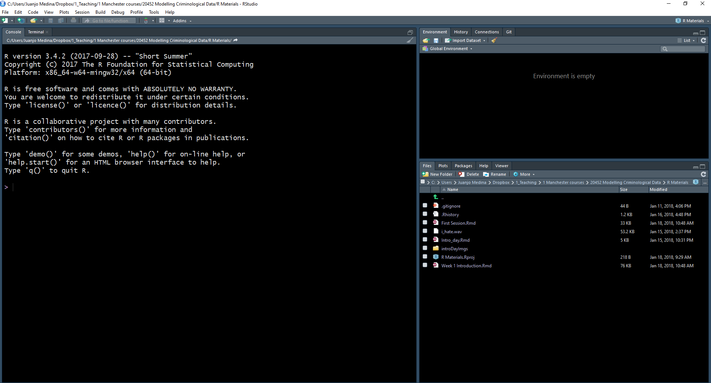
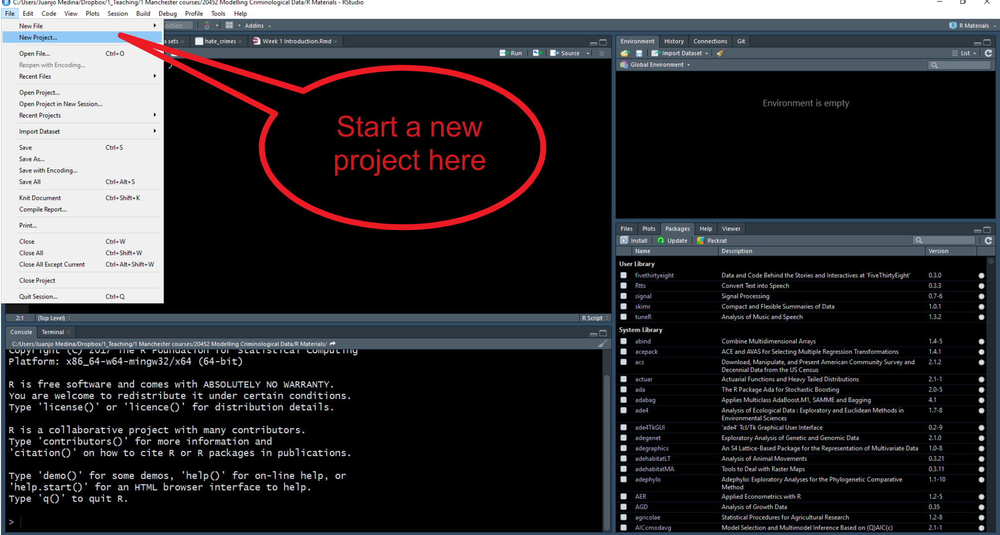
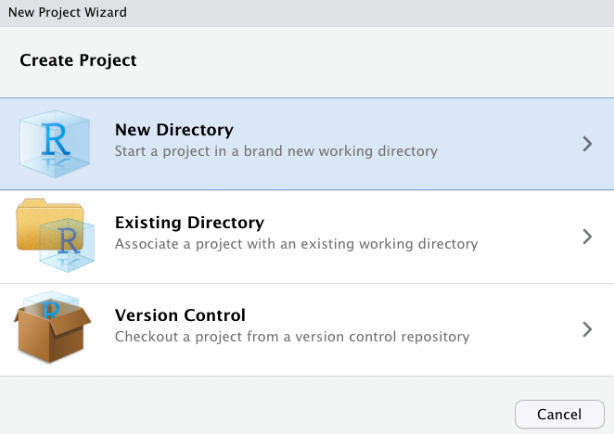
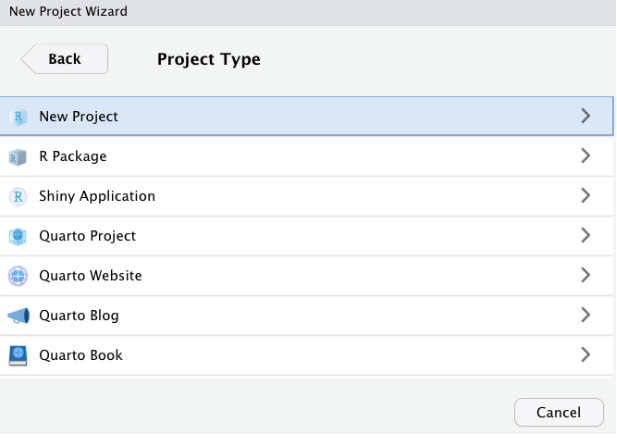
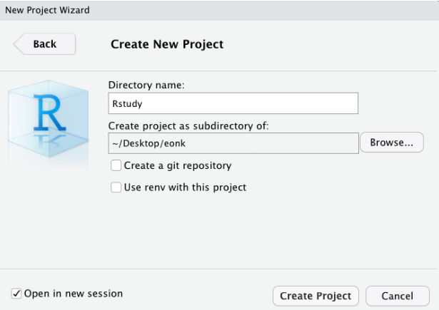
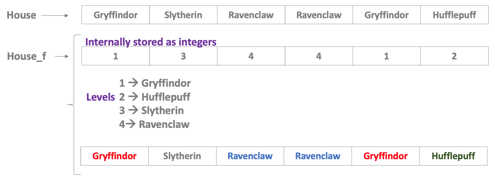

## ¿Cómo instalar R y RStudio?

Recomendamos que utilices tu propio ordenador portátil para este curso. Si aún no lo has hecho, descarga e instala R y RStudio en tu ordenador portátil. Haz clic [aquí](https://www.youtube.com/watch?v=eD07NznguA4) para obtener instrucciones sobre cómo hacerlo en Windows o [aquí](https://www.youtube.com/watch?v=E8IFmqSXjDc) para obtener instrucciones sobre cómo hacerlo en Mac. Si utiliza un Mac, sería conveniente que utilizaras la versión más actualizada del sistema operativo o, al menos, una compatible con la versión más reciente de R. Lee [esto](https://www.howtogeek.com/350906/how-to-check-which-version-of-macos-youre-using/) si deseas saber cómo hacerlo.

## Abre y explora RStudio

En esta sesión, nos centraremos en familiarizarnos con R Studio. Se puede utilizar R sin RStudio, pero RStudio es una aplicación que facilita el trabajo con R. RStudio ejecuta automáticamente R en segundo plano. En esta unidad del curso interactuaremos con R a través de RStudio.

{width="80%"}

Cuando abras R Studio por primera vez, verás (como en la imagen anterior) que hay tres paneles principales. El más grande, a la izquierda, es la consola. Si lees el texto de la consola, verás que R Studio está abriendo R y podrás ver qué versión de R estás ejecutando. Dependiendo de que máquina estas usando, esto puede variar, pero no te preocupes demasiado por ello.

{width="80%"}

La vista en R Studio está estructurada de manera que en una sesión normal se muestran cuatro paneles abiertos. Haz clic en el menú desplegable *File*, selecciona *New File* y, a continuación, *R Script*. Ahora verás las cuatro áreas de la ventana en pantalla. En cada una de estas áreas puedes cambiar entre diferentes vistas y paneles. También puedes utilizar el ratón para cambiar el tamaño de las diferentes ventanas si te resulta más cómodo.

{width="80%"}

Fíjate, por ejemplo, en la zona inferior derecha. En esta zona puedes ver que hay diferentes pestañas, que están asociadas a diferentes vistas. En las pestañas de esta sección se pueden ver que hay diferentes vistas disponibles: *Files*, *Plots*, *Packages*, *Help*, *Viewer* y *Presentation*. La pestaña **Files** te permite ver los archivos del directorio físico que está configurado actualmente como tu entorno de trabajo. Puedes considerarla como una ventana del Explorador de Windows que te permite ver el contenido de una carpeta.

En el panel **Plots** verás cualquier visualización de datos o representación gráfica de datos que produzcas. Todavía no hemos producido ninguno, por lo que por ahora está vacío. Si haces clic en **Packages**, verás los paquetes que están disponibles actualmente en tu instalación. ¿Qué es un «paquete» en este contexto?

Los paquetes son módulos que amplían las funciones de R. Hay miles de ellos. Algunos vienen preinstalados cuando se realiza una instalación básica de R. Otros los eliges e instalas tú mismo. En este curso presentaremos algunos paquetes importantes que recomendamos y que deberías instalar.

El otro panel realmente útil en esta parte de la pantalla es el visor de **Help**. Aquí puedes acceder a la documentación de los distintos paquetes que componen R. Aprender a utilizar esta documentación será esencial si deseas sacar el máximo partido a R.

En la esquina diagonalmente opuesta, la superior izquierda, ahora debería tener una ventana de script abierta. El **Script** es donde se escribe el código de programación, las instrucciones que se envían al ordenador. Un script no es más que un archivo de texto en el que se puede escribir. A diferencia de otros programas de análisis de datos que hayas utilizado anteriormente (Excel, SPSS), debes interactuar con R escribiendo instrucciones y pidiendo a R que las evalúe. R es un lenguaje de programación *interpretado*: escribes instrucciones (código) que el motor R tiene que interpretar para hacer algo. Y todas las instrucciones que escribimos pueden y deben guardarse en un script, para que puedas recuperar más tarde lo que hiciste y tu "yo futuro" entienda y recuerde lo que hizo tu "yo pasado".

Una de las principales ventajas de realizar el análisis de datos de esta manera es que se genera un registro escrito de cada paso que se da en el análisis. Sin embargo, el reto es que hay que aprender este lenguaje para poder utilizarlo. Ese será el objetivo principal de este curso: enseñarte a escribir código R para el análisis de datos.

Como con cualquier lenguaje, cuanto más lo practiques, más fácil te resultará. La mayoría de las veces copiarás y pegarás fragmentos de código que te proporcionaremos. Pero también esperamos que desarrolles una comprensión básica de lo que hacen estos fragmentos de código. Es un poco como cocinar. Al principio, solo seguirás las recetas tal y como se te dan, pero a medida que te sienta más cómodo en tu «cocina», te sentirás más cómodo experimentando.

La ventaja de realizar el análisis de esta manera es que, una vez que hayas escrito tus instrucciones y las haya guardado en un archivo, podrá compartirlas con otras personas y ejecutarlas cada vez que lo desees en cuestión de segundos. Esto crea un registro *reproducible* de tu análisis: algo que tus colaboradores u otras personas en cualquier lugar (incluido tu yo futuro, el que habrá olvidado cómo hacer las cosas) podrían ejecutar y obtener los mismos resultados que obtuviste en algún momento anterior.

Esto hace que la ciencia sea más transparente, y la transparencia conlleva muchas ventajas. Por ejemplo, hace que tu investigación sea más fiable. No subestimes lo importante que es esto. La **reproducibilidad** se está convirtiendo en un criterio clave para evaluar la buena calidad de la investigación. Y herramientas como R nos permiten mejorarla. Si quieres saber más sobre la investigación reproducible, puedes leer más [aquí](http://theconversation.com/the-science-reproducibility-crisis-and-what-can-be-done-about-it-74198).

## Personalizar el aspecto de RStudio

RStudio te permite personalizar su aspecto. Por ejemplo, trabajar con fondos blancos no suele ser una buena idea si te preocupa tu vista. Si no quieres acabar con los ojos secos, no solo es recomendable que sigas la regla 20-20-20 (cada 20 minutos, mira durante 20 segundos un objeto situado a 20 metros de distancia), sino que también puede ser una buena idea utilizar fondos de pantallas más agradables para la vista (por ejemplo, un modo oscuro).

Haz clic en el menú *Tools* y selecciona *Global options*. Se abrirá una ventana emergente con varias opciones. Selecciona *Appearance*. En esta sección puedes cambiar el tipo y tamaño de la fuente, pero también el tipo de fondo del tema que R utilizará en las distintas ventanas. Tengo problemas de visión, por lo que a menudo aumento el tipo de fuente. También utilizo el tema *Tomorrow Night Bright* para evitar que mis ojos se sequen demasiado por el esfuerzo de leer una pantalla iluminada, pero es posible que tu prefieras otro diferente. Puedes previsualizarlos y luego hacer clic en aplicar para seleccionar el que más te guste. Esto no cambiará tus resultados ni tu análisis. Es solo algo que quizá desees hacer para que todo se vea mejor y sea más saludable para tí.

## Organización: Proyectos R

Siempre que realices un análisis, trabajarás con una gran variedad de archivos. Es posible que tengas un fichero de datos de Excel (o algún otro tipo de archivo de datos, como csv, por ejemplo), un archivo de Microsoft Word o parecido en el que está escribiendo el ensayo con tus resultados, pero también un script con todo el código de programación que has estado utilizando. R necesita saber dónde se encuentran todos estos archivos en tu ordenador. A menudo recibirás mensajes de error porque esperas que R encuentre uno de estos archivos en una ubicación incorrecta. **Por lo tanto, es absolutamente fundamental que comprendas cómo tu ordenador organiza y almacena los archivos.** Puedes ver los siguientes vídeos para comprender los conceptos básicos de la gestión de archivos y las rutas de archivo:

[Usuarios de Windows](https://www.youtube.com/watch?v=k-EID5_2D9U)

[Usuarios de MAC](https://www.switchingtomac.com/tutorials/osx/5-ways-to-reveal-the-path-of-a-file-on-macos/)

La mejor manera de evitar problemas con la gestión de archivos en R es utilizando lo que RStudio denomina **R Projects**.

Técnicamente, un proyecto RStudio es simplemente un directorio (una carpeta) con el nombre del proyecto y algunos archivos y carpetas creados por R Studio para fines internos. Aquí es donde debes guardar tus scripts, tus datos y tus informes. Puedes gestionar esta carpeta con el administrador de su propio sistema operativo (por ejemplo, el Explorador de Windows) o a través del administrador de archivos de R Studio (al que se accede en la esquina inferior derecha de las ventanas de RStudio). Cuando se vuelve a abrir un proyecto, RStudio abre todos los archivos y vistas de datos que estaban abiertos cuando se cerró el proyecto la última vez.

Aprendamos a crear un proyecto. Vaya al menú desplegable *File* y seleccione *New Project*.

{width="80%"}

Se abrirá un cuadro de diálogo en el que se te pedirá que especifiques qué tipo de directorio deseas crear. Selecciona nuevo directorio de trabajo en este cuadro de diálogo.

{width="80%"}

Ahora aparecerá otro cuadro de diálogo en el que tendrás que especificar qué tipo de proyecto deseas crear. Selecciona la primera opción, «New Project».

{width="80%"}

Por último, podrás seleccionar un nombre para tu proyecto (en la imagen siguiente utilizo el nombre "Rstudy", pero puedes utilizar cualquier nombre sensato que prefieras) y tendrás que especificar la carpeta/directorio en el que colocar este directorio. Selecciona la ubicación que prefieras en tu ordenador portátil (preferiblemente, para evitar problemas más adelante no eligas el escritorio).

{width="80%"}

En proyectos sencillos, es posible que solo tengas un archivo de script y un archivo de datos. Sin embargo, en proyectos más complejos, las cosas pueden complicarse rápidamente. Por lo tanto, es posible que desees crear subdirectorios dentro de la carpeta del proyecto. Normalmente yo utilizo la siguiente estructura en mi trabajo para colocar todos los archivos de un determinado tipo en el mismo subdirectorio:

-   *Scripts y código*: aquí guardo todos los archivos de texto con mi código analítico.

-   *Datos de origen*: aquí guardo los datos originales. Suelo no tocar esta carpeta una vez que he obtenido los datos originales.

-   *Documentación*: este es el subdirectorio donde guardo toda la documentación de los datos (por ejemplo, libros de códigos, cuestionarios, etc.).

-   *Datos modificados*: todos los análisis implican realizar transformaciones y cambios en los archivos de datos originales. No conviene alterar los archivos de datos originales, por lo que lo que hay que hacer es crear nuevos archivos de datos tan pronto como se empiecen a modificar los datos de origen. Yo los coloco en un subdirectorio diferente.

-   *Bibliografía*: El análisis consiste en responder a preguntas de investigación. Siempre hay bibliografía sobre estas preguntas. Coloco la bibliografía particularmente relevante para el proyecto analítico que estoy llevando a cabo en este subdirectorio.

-   *Informes y redacción*: Aquí es donde archivo todos los informes y visualizaciones de datos relacionados con mi análisis.

Puede crear estos subdirectorios utilizando el Explorador de Windows o la ventana Archivos en R Studio.

## Funciones: Habla con tu ordenador

Hasta ahora hemos visto una introducción a la interfaz principal que vas a utilizar y hemos hablado de los proyectos de RStudio. En esta unidad vas a utilizar esta interfaz y vas a crear y utilizar archivos dentro de tus proyectos de RStudio para producir análisis basados en código de programación que tendrás que escribir utilizando el lenguaje R.

Escribamos un código muy sencillo utilizando R para comunicarnos con tu ordenador. Primero, abre un nuevo script dentro del proyecto que acabas de crear. Escribe las siguientes instrucciones en la ventana del script. Cuando hayas terminado, haz clic en la esquina superior derecha donde dice *Run* (si prefieres los atajos rápidos, puedes seleccionar el texto y luego pulsar Ctrl + Enter):

```{r}
print("Me encanta programar")
```

¡Enhorabuena! ¡Acabas de ejecutar tu primera línea de código R! 👏👏

En este manual verás cuadros en gris con fragmentos de código. Puedes copiar y pegar este código en la ventana de tu script y ejecutarlo desde allí para reproducir nuestros resultados. A medida que avancemos, iremos cubriendo nuevos fragmentos de código.

A veces, en estos documentos verás los resultados de la ejecución del código, lo que se muestra en tu consola o en tu visor de gráficos. Los resultados aparecerán dentro de un cuadro como el anterior.

El lenguaje R utiliza **funciones** para indicar al ordenador qué debe hacer. En el *lenguaje* R, las funciones son los *verbos*. Puede pensar en las funciones como comandos predefinidos que alguien ya ha programado en R y que le indican a R qué debe hacer. Aquí has aprendido tu primera función R: *print*. Lo único que hace esta función es pedirle a R que imprima lo que quieras en la consola principal (véase la ventana de la esquina inferior izquierda).

En R, se pueden pasar varios **argumentos** a cualquier función. Estos argumentos controlan lo que hará la función en cada caso. Los argumentos aparecen entre parentesis. Aquí hemos pasado el texto «Me encanta programar» como argumento. Una vez ejecutado el programa, al hacer clic en *Run*, el motor R envía esto a la CPU de tu máquina en forma de código binario y esto produce un resultado. En este caso, vemos ese resultado impreso en la consola principal.

Cada función de R admite diferentes tipos de argumentos. Aprender R implica no solo aprender diferentes funciones, sino también aprender cuáles son los argumentos válidos que se pueden pasar a cada función.

{width="80%"}

Como se ha indicado anteriormente, la ventana de la esquina inferior izquierda es la **consola** principal. Si ejecutaste el código anterior, verás que allí aparecen impresas las palabras «Me encanta programar». Si en lugar de utilizar RStudio estuvieras trabajando directamente desde R, eso es todo lo que obtendrías: la consola principal, donde puedes escribir código de forma interactiva (en lugar de todas las diferentes ventanas que ves en RStudio). Puede escribir tu código directamente en la consola principal y ejecutarlo línea por línea de forma interactiva. Sin embargo, lo recomendable es ejecutar el código desde scripts, para que te acostumbres a la idea de documentar adecuadamente todos los pasos que das.

## Más información sobre los paquetes

Anteriormente describimos los paquetes como elementos que añaden funcionalidad a R. Lo que hacen la mayoría de los paquetes es introducir nuevas funciones que permiten pedirle a R que haga cosas nuevas y diferentes que no forman parte de su funcionalidad básica.

Cualquiera, con suficientes conocimientos de R, puede escribir un paquete, por lo que los paquetes de R varían en calidad y complejidad. También se pueden encontrar paquetes en diferentes lugares, desde repositorios oficiales (lo que significa que han pasado un control de calidad mínimo), algo llamado GitHub (una página web donde los desarrolladores de software publican trabajos en curso), hasta páginas web personales (¡peligro, peligro!). En marzo de 2026 hay 23295 solo en el repositorio oficial principal, por lo que el número de cosas que se pueden hacer con R crece exponencialmente cada día, ya que la gente sigue añadiendo nuevos paquetes.

Cuando instalas R, solo instalas un conjunto de paquetes básicos, no los más de 23295 completos. Por lo tanto, si quieres utilizar cualquiera de estos paquetes añadidos que no forman parte de la instalación básica, primero debes instalarlos. Puedes ver qué paquetes están disponibles en tu instalación local mirando la pestaña *Packages* en el panel de la esquina inferior derecha. Haz clic allí y compruébalo. Vamos a instalar un paquete que no está ahí para que veas cómo se realiza la instalación.

{width="80%"}

Si acaba de instalar R en su ordenador portátil, verás una lista bastante breve de paquetes que constituyen la instalación básica de R. Sin embargo, es fundamental saber cómo instalar paquetes, ya que lo harás con bastante frecuencia.

Vamos a instalar un paquete llamado «cowsay» para mostrar el proceso. En el panel Paquetes hay un menú *Install* que abre un cuadro de diálogo y le permite instalar paquetes. En vez de usar esta opción, vamos a utilizar código para hacerlo, para instalar este paquete. Solo tienes que copiar y pegar el código siguiente en tu script y ejecutarlo:

```{r, eval=FALSE}
install.packages("cowsay")
```

Aquí estamos introduciendo una nueva función «install.packages» y lo que hemos pasado como argumento es el nombre del paquete que queremos instalar. Así es como instalamos un paquete *que está disponible en el repositorio oficial CRAN*. Dado que te estás conectando a un repositorio en línea, necesitarás una conexión a Internet cada vez que quieras instalar un paquete.

[CRAN](https://cran.r-project.org/) es un repositorio oficial que cuenta con una colección de paquetes R que cumplen con un conjunto mínimo de criterios de calidad. Es un lugar bastante seguro para obtener paquetes. Si quisiéramos instalar un paquete de otro lugar, tendríamos que adaptar el código. Más adelante en otras sesiones verás cómo se instalan paquetes desde GitHub.

Esta línea de código (tal y como está escrita actualmente) instalará este paquete en una biblioteca personal. Si utilizas un equipo con Windows, este código colocará este paquete en una biblioteca personal dentro de su carpeta "Documentos". Una vez que instale un paquete, permanecerá en el equipo/ubicación donde lo instale hasta que lo elimines físicamente.

¿Cómo se averigua qué hace un paquete? Consultando la documentación correspondiente. En la ventana Packages, desplázate hacia abajo hasta encontrar el nuevo paquete que hemos instalado. Aquí verás el nombre del paquete (cowsay), una breve descripción de lo que hace el programa y la versión que has instalado (una indicación de que un paquete es bueno es que haya pasado por varias versiones, lo que significa que alguien se asegura de que el paquete reciba actualizaciones y mejoras periódicas). La versión que tengo para cowsay es la 1.2.0. La tuya puede ser más antigua o más reciente. En este momento, eso no tiene mucha importancia.

Haga clic en el nombre *cowsay*. Verá que RStudio te ha llevado a la pestaña Help. Aquí encontrará los archivos de ayuda para este paquete, incluida toda la documentación disponible.

A todos los principiantes en R les resultarán un poco confusos estos archivos de ayuda. Pero al cabo de un tiempo, su formato y estructura empezarán a tener sentido para tí. Haz clic donde dice *User guides, package vignettes, and other documentation*. La documentación en R ha mejorado mucho desde que la gente empezó a escribir **viñetas** para sus paquetes. Son pequeños tutoriales que explican con ejemplos lo que hace cada paquete. Haga clic en *cowsay::cowsay_tutorial* que aparece en la lista. Encontrarás un archivo html que te ofrece un tutorial detallado sobre este paquete. No es necesario que lo leas ahora, pero recuerda que esta es una forma de encontrar ayuda cuando utilice R.

Probemos algunas de las funciones de este paquete. Usaremos la función «say»:

```{r, eval=FALSE}
say("Me encanta programar")
```

Aparecerá un mensaje de error indicando que no se ha encontrado esta función. ¿Qué ha pasado? Este será el primero de muchos mensajes de error que recibirás. Un mensaje de error es la forma que tiene el ordenador de indicarte que tus instrucciones son incompletas o problemáticas y, por lo tanto, no puede hacer lo que le pides. Es increiblemente frustrante recibir estos mensajes, pero una habilidad fundamental para ti este semestre será superar esa frustración e intentar comprender por qué el ordenador no puede hacer lo que le pides. Descubrir el origen del error y resolverlo es el objetivo de estas sesiones. No hay nada malo en recibir errores. El problema es si te rindes y dejas que la frustración te domine.

Entonces, ¿por qué nos aparece este error? Instalar un paquete es solo el primer paso para poder usarlo. El siguiente paso, cuando quieres utilizarlo en una sesión determinada, es **cargarlo**.

Piensa en ello como en un par de zapatos. Los compras una vez, pero tienes que sacarlos del armario y calzarlos cuando quieres disfrutar de su uso. Lo mismo ocurre con los paquetes: solo los instalas una vez, pero tienes que cargarlos desde tu "biblioteca" cada vez que quieras utilizarlos dentro de una sesión determinada (una vez cargados, permanecerán cargados hasta que finalices la sesión).

Para ver qué paquetes tienes actualmente **cargados** en tu sesión, utiliza la función `search()` (en este caso, no es necesario pasarle ningún argumento).

```{r}
search()
```

Si ejecutas este código, verás que `cowsay` no está en la lista de paquetes cargados. Por lo tanto, tu ordenador no puede utilizar ninguna de las funciones asociadas a él hasta que lo cargues. Para cargar un paquete utilizamos la función **library**. Así que si queremos cargar el nuevo paquete que hemos instalado en nuestra máquina, tendríamos que utilizar el siguiente código:

```{r}
library("cowsay")
```

Vuelve a ejecutar la función «search». Ahora verás que este paquete aparece en la lista. Así que ahora podemos volver a probar la función «say».

```{r}
say("Me encanta programar")
```

Obtienes un animal aleatorio en la consola que repite el texto que pasamos como argumento. Si nos gusta otro animal, podemos pasar un argumento para seleccionarlo de forma explícita. Por ejemplo, si queremos un mono en lugar de un animal aleatorio, pasaríamos los siguientes argumentos a nuestra función.

```{r}
say("Me encanta programar", "monkey")
```

Esta es una característica importante de los argumentos en las funciones. Hemos dicho que diferentes funciones admiten diferentes argumentos. Aquí, al especificar «monkey», la función imprime ese animal en concreto. Pero, ¿por qué obtenemos un resultado aunque no hayamos especificado un tipo de animal concreto? Esto ocurre porque las funciones siempre tienen argumentos predeterminados que son necesarios para su ejecución y que no es necesario especificar explícitamente. Los argumentos predeterminados son implícitos y no es necesario escribirlos. La función «say» tiene un argumento predeterminado que imprimirá un carácter o animal aleatorio. Solo cuando se desea cambiar el valor predeterminado es necesario especificar explícitamente un animal alternativo.

Recuerda que solo tienes que instalar una vez los paquetes que aún no estén instalados. Pero si quieres utilizarlos en una sesión determinada, tendrás que cargarlos dentro de esa sesión utilizando la función «library». Una vez que los cargues dentro de una sesión, los paquetes permanecerán cargados hasta que termines la sesión (por ejemplo, cerrando RStudio). No lo olvides.

## Objetos: creación de un objeto

Hemos visto cómo el primer argumento que toma la función «say» es el texto que queremos convertir en voz para nuestro animal determinado. Podríamos escribir el texto directamente en la función (como hicimos anteriormente), pero ahora vamos a hacer algo diferente. Vamos a crear un objeto para almacenar el texto.

¿Un **objeto**? ¿Qué quiero decir con eso? Del mismo modo que todo lo que haces en R lo haces con funciones (tus verbos), todo lo que existe en R es un objeto. Puedes pensar en los objetos como cajas en las que guardas cosas. En este caso, vamos a crear un objeto llamado *my_text* y dentro de este objeto vamos a almacenar el texto «Me encanta programar». ¿Cómo se hace esto? Utilizaremos el siguiente código:

```{r}
my_text <- "Me encanta programar"
```

Este fragmento de código simplemente le indica a R que estamos creando un nuevo objeto con el nombre asignado («my_text»). Estamos creando un cajón con ese nombre y dentro de él colocamos un fragmento de texto («Me encanta programar»). La flecha `<-` que ves es el **operador de asignación**. Se trata de una parte importante del lenguaje R que le indica a R lo que estamos incluyendo dentro del objeto en cuestión.

Ejecuta el código. Ahora mira la ventana *Environment* (Entorno) en la esquina superior derecha. Vemos que este objeto ahora aparece allí. Puedes pensar en el Entorno como un almacén donde guardas cosas, tus diferentes objetos. ¿Hay algún límite para este entorno? Sí, tu RAM. R funciona en tu RAM, por lo que debes tener en cuenta que si utilizas objetos muy grandes necesitarás mucha RAM. Pero eso no será un problema que encontrarás en esta unidad del curso.

Una vez que colocamos elementos en estas cajas u objetos, podemos utilizarlos como argumentos en nuestras funciones. Vea el ejemplo siguiente:

```{r}
say(my_text, "cow")
```

## Más información sobre objetos

Ahora que hemos cubierto algunos de los aspectos preliminares, podemos pasar a hablar de los datos. En Excel, estás acostumbrado a ver tus datos en formato de hoja de cálculo. Si necesita un resumen, te recomendamos que revises algunos de los materiales diseñados para estudiantes universitarios de Criminología. Este [capítulo](https://maczokni.github.io/MSCD_labs/week1.html#data-variables-and-observations) te ayudará a comprender mejor los conceptos de conjunto de datos, niveles de medición y datos "ordenados".

R es considerablemente más flexible que Excel. La mayor parte del trabajo que hacemos aquí utilizará ficheros o bases de datos, "dataframes" es como se denominan en R. Pero, como has visto anteriormente, en R puedes tener *objetos* distintos de las bases de datos. Estos objetos pueden estar relacionados con archivos externos o con información textual simple («Me encanta programar»). Esta flexibilidad es una gran ventaja porque, entre otras cosas, nos permite desglosar las bases de datos o los resultados de los análisis realizados sobre ellos en sus partes constitutivas (esto quedará más claro a medida que avancemos).

Técnicamente, R es un *lenguaje orientado a objetos*. La programación orientada a objetos (OOP) es un modelo de lenguaje de programación organizado en torno a objetos en lugar de «acciones» y datos en lugar de lógica.

Como hemos visto anteriormente, para crear un objeto hay que darle un nombre y, a continuación, utilizar el operador de asignación (el símbolo `<-`) para asignarle algún valor.

Por ejemplo, si queremos crear un objeto al que llamamos «x» y queremos que represente el valor 5, escribimos:

```{r}
x <- 5
```

Simplemente le estamos diciendo a R que cree un **objeto numérico**, llamado `x`, con un elemento (5) o de longitud 1. Es numérico porque estamos poniendo un número dentro de este objeto. La longitud es 1 porque solo tiene un elemento, el número 5.

Puedes ver el contenido del objeto `x` en la consola principal utilizando la función de impresión que hemos usado anteriormente ("print") o mediante la impresión automática, es decir, simplemente escribiendo el nombre del objeto y ejecutándolo como código:

```{r}
x
```

Al escribir expresiones en R, es muy importante que comprendas que **R distingue entre mayúsculas y minúsculas**. Esto puede volverte loco si no tienes cuidado. La mayoría de las veces, si escribes una expresión pidiendo a R que haga algo y R devuelve un mensaje de error, lo más probable es que hayas utilizado minúsculas cuando se necesitaban mayúsculas (o viceversa). Por lo tanto, comprueba siempre que la ortografía sea correcta. Por ejemplo, mira lo que ocurre si utilizo una «X» mayúscula:

```{r, error = TRUE}
X
```

Aparecerá el siguiente mensaje: «Error en eval(expr, envir, enclos): object “X” not found». R nos está indicando que X no existe. ¡Claro! No hay ningún objeto X (mayúscula), pero sí hay un objeto x (minúscula). Los mensajes de error en R son bastante precisos a la hora de indicar qué es lo que ha fallado exactamente. No obstante, algunos, sobre todo al principio de proceso de aprendizaje, te pueden resultar algo confusos.

Recuerda que los ordenadores son muy literales. Son como los perros. Puedes decirle a un perro «siéntate» y, si ha sido entrenado, se sentará. Pero si le dices a un perro «¿serías tan amable de relajarte un poco y tumbarte en el sofá?», no tendrá ni idea de lo que le estás diciendo y te mirará como si te hubieras vuelto loco. Los mensajes de error son la forma que tienen las computadoras de decirnos «Realmente quiero ayudarte, pero no entiendo lo que quieres decir» (nunca te lo tomes como algo personal, las computadoras no te odian).

Cuando recibes un mensaje de error o resultados inverosímiles, debes revisar tu código para averiguar cuál es el problema. Este proceso se denomina **depuración**. Existen algunas formas sistemáticas adecuadas de escribir código que facilitan la depuración, pero no las abordaremos aquí. R es muy bueno con el manejo automático de errores en los niveles en los que lo utilizaremos. Muy a menudo, la solución consistirá simplemente en corregir la ortografía.

Un consejo útil es copiar y pegar el mensaje de error en Google y buscar una solución. Si alguien me hubiera dado un centavo por cada vez que he tenido que hacer eso, ahora sería Bill Gates. Probablemente no seas la primera persona en cometer ese error y seguro que alguien en Internet ya ha encontrado una solución a tu problema. La gente comete errores constantemente. Así es como aprendemos. No te frustres, no te quedes atascado. En lugar de eso, busca una solución. Hoy en día tenemos Google (o alguna inteligencia artificial, que suelen ser útiles en materia de programación). Antes no lo teníamos. Ahora tienes la respuesta a tu frustración al alcance de la mano. Úsala en tu beneficio.

## Tipos de objetos en R: vectores

En R hay diferentes tipos de objetos. Comenzaremos con los **vectores**.

¿Qué es un vector? Un vector es simplemente un conjunto de elementos *de la misma clase* (normalmente estas clases son: carácter, numérico, número entero, o lógico, como en Verdadero/Falso). Los vectores son la estructura de datos básica en R.

Normalmente, se utiliza la función `c()` (c significa *concatenar*) para crear vectores. El código siguiente muestra cómo crear vectores de diferentes clases (numéricos, lógicos, caracteres, etc.). Observe cómo los elementos enumerados (para simplificar, hay dos elementos en cada vector siguiente) están separados por comas `,`:

```{r}
my_1st_vector <- c(0.5, 0.6) #crea un vector numérico con dos elementos
my_2nd_vector <- c(1L, 2L) #crea un vector entero (el sufijo «L» especifica un número entero)
my_3rd_vector <- c(TRUE, FALSE) #crea un vector lógico
my_4th_vector <- c(T, F) #crea un vector lógico utilizando las abreviaturas de True y False, pero se debe evitar esta formulación y utilizar en su lugar la palabra completa.
my_5th_vector <- c("a", "b", "c") #crea un vector de caracteres
my_6th_vector <- c(1+0i, 2+4i) #crea un vector complejo (no lo usaremos realmente en este curso)
```

Corta y pega este código en tu script y ejecútalo. Verás cómo todos estos vectores se añaden a tu entorno global y se almacenan allí.

La belleza de un lenguaje estadístico orientado a objetos como R es que, una vez que tienes estos objetos, puedes utilizarlos como **entradas** en funciones, utilizarlos en operaciones o para crear otros objetos. Esto hace que R sea muy flexible. Vea algunos ejemplos a continuación:

```{r}
class(my_1st_vector) #una función para averiguar la clase del vector, que tipo de vector es
length(my_1st_vector) #una función para averiguar la longitud del vector
my_1st_vector + 2 #Añadir una constante de 2 a cada elemento del vector
my_7th_vector <- my_1st_vector + 1 #Crear un nuevo vector que contenga los elementos de my1stvector más una constante de 1
my_1st_vector + my_7th_vector #Suma los dos vectores e imprime automáticamente los resultados (fíjate en cómo se ha realizado la suma)
```

Como se ha indicado anteriormente, cuando creas objetos, los colocas en tu memoria de trabajo o espacio de trabajo. Cada sesión de R estará asociada a un espacio de trabajo (denominado «entorno global» en R Studio). En R Studio, puede visualizar los objetos que ha creado durante una sesión en la pantalla **Global Environment**. Pero si desea generar una lista de lo que hay allí, puede utilizar la función `ls()` (los resultados que obtenga pueden diferir de los que se muestran a continuación, dependiendo de lo que tengas realmente en tu entorno global).

```{r}
ls() #enumera todos los objetos presentes en el entorno global de esta sesión
```

Si desea eliminar un objeto concreto, puedes hacerlo utilizando la función `rm()`.

```{r}
rm(x) #elimina x de su entorno global
```

También es posible eliminar todos los objetos a la vez:

```{r}
rm(list = ls()) #elimina todos los objetos de su entorno global
```

Si mezclas elementos vectoriales de diferentes clases (por ejemplo, numéricos y lógicos), R **fuerza** al mínimo común denominador, de modo que todos los elementos del vector sean de la misma clase. Así, por ejemplo, si introduces un número y un carácter al crear un objeto, R forzará el vector a ser un vector de caracteres; consulta el ejemplo siguiente y fíjate en el uso de la función `class()` para identificar la clase de un objeto.

```{r}
my_8th_vector <- c(0.5, "a")
class(my_8th_vector)
```

## Tipos de objetos R: Dataframes

Bien, ahora que ya conoce algunos de los tipos básicos de objetos que puede utilizar en R, comencemos a hablar de los dataframes. Uno de los objetos más comunes con los que trabajará en este curso son los **dataframes**. Los dataframes se pueden crear con la función `data.frame()`.

Las bases o ficheros de datos son *vectores múltiples* de clases posiblemente diferentes (por ejemplo, numéricas, factores, caracteres), pero de la misma longitud (por ejemplo, todos los vectores o variables tienen el mismo número de filas). Esto puede sonar un poco técnico, pero es simplemente una forma de decir que un marco de datos es lo que en otros programas de análisis de datos se representa como conjuntos de datos, las hojas de cálculo tabulares que has visto al utilizar Excel.

{width="80%"}

Creemos un dataframe con dos variables:

```{r}
#Creamos un dataframe llamado mydata_1 con dos variables, un vector de números enteros llamado foo y un vector lógico llamado bar.
mydata_1 <- data.frame(foo = 1:4, bar = c(T,T,F,F))
mydata_1
```

O, alternativamente, para obtener el mismo resultado:

```{r}
x <- 1:4
y <- c(T, T, F, F)
mydata_2 <- data.frame (foo = x, bar = y)
mydata_2
```

Como puedes ver en R, al igual que en cualquier otro lenguaje, hay múltiples formas de decir lo mismo. Los programadores buscan producir código optimizado: que sea breve y rápido. Es probable que, a medida que desarrolles tus habilidades en R, encuentres formas cada vez más eficientes de pedirle a R que haga cosas. Esto también significa que, cuando pidas ayuda, ya sea a tus compañeros o a nosotros, es posible que te enseñemos formas ligeramente diferentes de obtener el resultado correcto. Lo importante en este momento es que obtengas el resultado correcto.

Estos son ejemplos sencillos de marcos de datos. En este curso, utilizaremos datos reales. La semana que viene aprenderemos con más detalle cómo leer datos en R. Pero también debes saber que R viene con conjuntos de datos preinstalados. De hecho, algunos paquetes no son más que colecciones de dataframes.

Echemos un vistazo a algunos de ellos. Vamos a ver algunos datos que forman parte del paquete *fivethirtyeight*. Este paquete contiene conjuntos de datos y código detrás de las historias de [este periódico online en particular](http://fivethirtyeight.com/). Este paquete no forma parte de la instalación básica de R, por lo que primero tendrás que instalarlo. No te daré el código para ello. A ver si puedes averiguarlo mirando los ejemplos anteriores.

¿Listo? Bien, ahora vamos a ver los conjuntos de datos que se incluyen en este paquete. Recuerda que primero tenemos que **instalar** y **cargar** el paquete si queremos utilizarlo:

```{r}
library(fivethirtyeight)
data(package="fivethirtyeight") #Esta función devolverá todos los dataframes disponibles en el paquete indicado.
```

Observa que este paquete contiene algunos conjuntos de datos relacionados con historias tratadas en esta revista que tenían un enfoque criminológico. Veamos, por ejemplo, el conjunto de datos hate_crimes. ¿Cómo se hace eso? Primero tenemos que cargar el marco de datos en nuestro entorno global. Para ello, utiliza el siguiente código:

```{r}
data("hate_crimes")
```

Esta función buscará entre todos los paquetes *cargados* y localizará el conjunto de datos «hate_crimes». Observe que ahora aparece en el entorno global, aunque también dice «promesa» junto a él. Para ver los datos completos, primero hay que hacer algo con ellos. Así que hagámoslo.

Todos los objetos en R pueden tener **atributos**. Estos son: nombres; dimensiones (para matrices y matrices: número de filas y columnas) y nombres de dimensiones; clase de objeto (numérico, carácter, etc.); longitud (para un vector, será el número de elementos del vector); y otros definidos por el usuario. Puede acceder a los atributos de un objeto utilizando la función `attributes()`. Consultemos a R los atributos de este conjunto de datos.

```{r}

attributes(hate_crimes)
```

Es posible que estos resultados impresos en la consola no tengan mucho sentido para ti en este momento. Volveremos a ello la semana que viene, así que no te preocupes.

Ahora ve al panel de entorno global y haz clic con el botón izquierdo del ratón en el marco de datos «hate_crimes». Se abrirá el visor de datos en la sección superior izquierda de RStudio. Lo que verás allí es una hoja de cálculo con 13 variables y 51 observaciones. En este caso, cada variable te proporciona información (datos demográficos, patrones de voto y delitos de odio) sobre cada uno de los estados de EE. UU.

{width="80%"}

## Exploración de datos

Bien, ahora echemos un vistazo rápido a los datos. Hay tantas formas diferentes de generar estadísticas resumidas para los datos almacenados en R que es imposible abarcarlas todas. Solo presentaremos algunas funciones que pueden resultarte útiles para resumir datos. Antes de hacerlo, es importante que te hagas una idea de lo que hay disponible en este conjunto de datos. Ve a la pestaña de ayuda y, en el cuadro de búsqueda, introduce el nombre del marco de datos, lo que te llevará a la documentación de dicho dataframe. Aquí podrás ver una lista de las variables disponibles.

{width="80%"}

Empecemos con la *media*. Esta función toma como argumento la variable numérica para la que se desea obtener la media. Debido al funcionamiento de R, no basta con introducir el nombre de la variable, sino que también hay que indicar a R en qué dataframe se encuentra dicha variable. Para ello, se escribe el nombre del dataframe, el signo del dólar (`$`) y, a continuación, el nombre de la variable que se desea resumir. Si desea obtener la media de la variable que nos da la proporción de personas que votaron por Donald Trump (que es una variable en el fichero), puedes utilizar la siguiente expresión:

```{r}
mean(hate_crimes$share_vote_trump)
```

Este código indica que hay que buscar dentro del objeto del conjunto de datos «hate_crimes» la variable «share_vote_trump» y, a continuación, imprimir la media. El símbolo «\$» se utiliza cuando se desea buscar un componente concreto de un objeto. En el caso de los dataframes, ese componente suele ser uno de los vectores (variables). Sin embargo, a medida que avancemos en el curso, veremos otros usos para otros tipos de objetos.

Otra función que puede resultar útil con variables numéricas es `summary()`:

```{r}
summary(hate_crimes$share_vote_trump)
```

Esto te proporciona el resumen de cinco números (mínimo, primer cuartil, mediana, tercer cuartil y máximo, además de la media y el recuento de valores perdidos, si los hay).

No es necesario especificar una variable, puedes solicitar estos resúmenes de todo el dataframe:

```{r}
summary(hate_crimes)
```

¿Ves cómo ahora obtenemos esta información para todas las variables de una sola vez?

Hay varias formas de obtener resultados en R. En particular, para el análisis estadístico básico e intermedio, muchas funciones y paquetes básicos pueden darte la respuesta que buscas. Por ejemplo, hay una variedad de paquetes que le permiten ver estadísticas descriptivas resumidas utilizando funciones definidas dentro de esos paquetes. Deberás instalar estos paquetes antes de poder utilizarlos.

Aquí solo voy a presentar uno de ellos: *skimr*. Es muy completo y lo mantiene una de mis antiguas profesoras de estadística, la criminóloga [Elin Waring](https://www.lehman.edu/academics/sociology/faculty-waring.php), un ejemplo de amabilidad y dedicación hacia sus alumnos.

Deberás instalarlo antes de nada. Utiliza el código que has aprendido para hacerlo y, a continuación, cárgualo. No te proporcionaré el código para ello, ya que a estas alturas ya deberías saber cómo hacerlo.

```{r, echo=FALSE}
library(skimr)
```

Una vez que hayas cargado el paquete *skimr*, podrás utilizarlo. Su función principal es *skim*. Al igual que *summary* para los dataframes, skim presenta los resultados de todas las columnas y las estadísticas que usara para resumir cada variable dependerán de la clase de la variable, de su escala de medición (nominal, ordinal, numérica). Sin embargo, los resultados se muestran y almacenan de una forma más agradable, aunque no entraremos en detalles al respecto por ahora.

```{r, eval = FALSE}
skim(hate_crimes)
```

```{r, echo=FALSE}
knitr::kable(skim(hate_crimes))
```

## Tipos de datos en R: Factores

Una cosa importante que hay que entender en R es que los datos categóricos (ordenados, también llamados ordinales, o no ordenados, también llamados nominales) se codifican *normalmente* como **factores**, que son simplemente un tipo especial de vector. Un factor es simplemente un vector que solo puede contener *valores predefinidos* (esto es muy importante) y se utiliza para almacenar datos categóricos. Muchas funciones de análisis y visualización de datos tratan los factores de forma especial. Esto tiene sentido, ya que son esencialmente diferentes de las variables cuantitativas.

Aunque se pueden utilizar números para representar categorías, *es mejor utilizar factores con etiquetas que números enteros para representar categorías*, ya que los factores son autodescriptivos (es mejor tener una variable con los valores «Masculino» y «Femenino» que una variable con los valores «1» y «2» para representar a hombres y mujeres). Cuando R lee datos en otros formatos (por ejemplo, separados por comas), por defecto convierte automáticamente todas las variables de caracteres en factores. Si prefieres mantener estas variables como vectores de caracteres simples, debes solicitarlo explícitamente a R. Volveremos sobre este tema en el proximo tema con algunos ejemplos.

Los factores también se pueden crear con la función `factor()` concatenando una serie de elementos *caracteres*. Observarás que se imprime de forma diferente a un vector de caracteres simple y que nos indica los niveles del factor (fíjate en la segunda línea impresa).

```{r}
the_smiths <- factor(c("Morrisey", "Marr", "Rourke", "Joyce")) #crea un nuevo factor
the_smiths #Imprime el factor
```

Alternativamente, para obtener un resultado similar utilizando la función as.factor(). Aquí creará el objeto `the_smiths_char` y luego lo transformará en una variable factorial, `the_smiths_f`.

```{r}
the_smiths_char <- c("Morrisey", "Marr", "Rourke", "Joyce") #crea un vector de caracteres
the_smiths_f <- as.factor(the_smiths_char) #crea un factor a partir de un vector de caracteres
the_smiths_f #Imprime el factor
```

Los factores en R pueden considerarse vectores con información adicional. Esta información adicional consiste en un registro de los valores distintos de ese vector, denominados **niveles**. Si deseas conocer los niveles de un factor determinado, puede utilizar la función `levels()`:

```{r}
levels(the_smiths_f)
```

Observa que los niveles aparecen impresos por orden alfabético (prueba con «levels(the_smiths_char)» y vea lo que dice R. Sí, `the_smiths_char` y `the_smiths_f` son diferentes). Habrá situaciones en las que este no sea el orden más conveniente (por ejemplo, *dic, ene, mar (orden alfabético)* en lugar de *ene, mar, dic*). Más adelante, en estos tutoriales, veremos cómo reordenar los niveles de los factores cuando sea necesario.

Veamos otro ejemplo más. Supongamos que estamos recopilando datos sobre las casas de Hogwarts, que se dividen en cuatro: Gryffindor, Hufflepuff, Ravenclaw y Slytherin.

```{r}
#Creamos un dataframe llamado HarryPotter con dos variables, un vector de caracteres llamado nombre y un vector de caracteres llamado casa
HarryPotter <- data.frame(name = c("Potter", "Malfoy", "Lovegood", "Chang", "Hagrid", "Diggory"), house = c("Gryffindor", "Slytherin", "Ravenclaw", "Ravenclaw", "Gryffindor", "Hufflepuff"))
HarryPotter
```

Utiliza «str(HarryPotter\$house)» y observa lo que dice R. R mostrará todas las observaciones de la variable y dirá que es una variable de caracteres, ¿verdad? Ahora vamos a convertir «house», una variable de caracteres, en una variable factorial «house_f.

```{r}
HarryPotter$house_f <- as.factor(HarryPotter$house)
str(HarryPotter$house_f)
levels(HarryPotter$house_f) ##prueba con «levels(HarryPotter$house)» y observa la diferencia
```

¿Ahora entiendes claramente qué significa **factor** en R? Los factores se utilizan para representar datos categóricos. Una vez creados, los factores pueden contener valores predefinidos, conocidos como «niveles».

{width="80%"}

## Convenciones para nombrar objetos en R

Quizás hayas notado los distintos nombres que he utilizado para designar objetos, sean vectores o dataframes, en los ejemplos que hemos usado hasta ahora (`my_1st_vector`, `the_smiths`, etc.). Puedes utilizar casi cualquier nombre que desees para tus objetos. Los objetos en R pueden tener nombres de cualquier longitud compuestos por letras, números, guiones bajos («\_») o puntos («.») y deben comenzar con una letra. Además, al nombrar objetos, debes recordar lo siguiente:

-   *Algunos nombres están prohibidos*. Entre ellos se incluyen palabras como FALSE y TRUE, operadores lógicos y palabras de programación como Inf, for, else, break, function, y palabras para entidades especiales como NA y NaN.

-   *Es recomendable utilizar nombres que no correspondan a una función específica.* Hemos visto, por ejemplo, que hay una función llamada `print()`, por lo que no conviene llamar a un objeto «print» para evitar conflictos. Para evitarlo, utiliza sustantivos en lugar de verbos para nombrar tus variables y datos.

-   *No conviene que sean demasiado largos* (o te arrepentirás cada vez que necesites utilizar ese objeto en tu análisis: te sangrarán los dedos de tanto teclear).

-   *Es mejor que sean lo más intuitivas posible.*

-   *Es mejor seguir convenciones de nomenclatura coherentes.* [Los usuarios de R son muy malos en esto](http://journal.r-project.org/archive/2012-2/RJournal_2012-2_Baaaath.pdf). Pero podríamos mejorar si todos nos propusiéramos seguir convenciones similares. En estos folletos verás que sigo la convención «underscore_separated»; consulta [aquí](https://style.tidyverse.org/syntax.html) para obtener más detalles.

También es importante recordar que R siempre tratará los números como números. Esto parece sencillo, pero en realidad es importante tenerlo en cuenta. Podemos nombrar nuestras variables casi como queramos. EXCEPTO que no pueden ser números. Los números están **protegidos** por R. 1 siempre significará 1.

Si lo desea, pruébalo. Intenta crear una variable llamada 12 y asígnale el valor «doce». Podemos asignar un significado a algo utilizando los caracteres «\<-».

```{r, error=TRUE}
12 <- «twelve»
```

¡Obtendrás un error!

## Cómo importar datos

Los programadores somos perezosos, y el objetivo de utilizar interfaces basadas en código es evitar trabajos innecesarios, como descargar archivos con solo apuntar y hacer clic. Y cuando los datos están disponibles en línea en un formato adecuado, podemos indicarle a R que los lea directamente desde la web y eliminar así al intermediario (es decir, a nosotros mismos, con nuestra actividad de apuntar y hacer clic).

¿Cómo podemos hacerlo? Piensa en lo que hacemos cuando leemos un archivo. Decimos: «Querido R, me gustaría crear un nuevo objeto y lo llamaré `my_dataframe`». Para ello, escribimos el nombre que le damos al objeto y la función de asignación `<-` (operador de asignación). A continuación, a la derecha de la función de asignación, se encuentra el valor que estamos asignando a la variable. Por lo tanto, podría ser un fragmento de texto (como cuando se crea un objeto «my_text» y se le pasa el argumento «Me encanta programar»), o podría ser alguna función, por ejemplo, cuando se lee un archivo csv con la función «read_csv()».

Por lo tanto, si estamos leyendo un archivo CSV, también debemos especificar *dónde* leerlo. ¿Dónde debe buscar R para encontrar estos datos? Aquí es donde normalmente se introduce la ruta al archivo, ¿verdad?

Algo así como:

```{r, eval=FALSE}
my_dataframe <- read.csv('PATH_O_URL_AL_ARCHIVO_CSV')
```

¿Y qué pasa si tus datos no están en tu ordenador portátil o PC? Bueno, si hay alguna forma de que R pueda acceder a estos datos simplemente siguiendo una ruta, ¡entonces este método seguirá funcionando!

```{r, eval=FALSE}
#Ejemplo de cómo bajarías una base de datos de un sitio web
my_dataframe <- read.csv("www.data.com/data you want to import.csv")

```

En este ejemplo, al objeto my_dataframe se le asignaría el valor devuelto por la función read.csv() al leer el archivo desde el enlace «url» que proporcionaste. La ruta del archivo no es nada misterioso, la ruta del archivo es simplemente la *ruta* al *archivo* que deseas leer. Si se trata de un sitio web, entonces que así sea.

R también puede leer archivos de datos en otros formatos que son comunes en las ciencias sociales. Por ejemplo, Stata (.dta) utilizando la función `read_dta()` del paquete Haven, y archivos SPSS (.sav) utilizando la función `read_spss()`, también del paquete Haven. Hay muchas formas y códigos diferentes que podemos utilizar para importar datos a R. En este curso, ¡aprenderás uno por uno!

## Cómo usar «comentarios»

En los fragmentos de código anteriores, habrás notado que hay partes que aparecen en gris. Fíjate, por ejemplo, en el último ejemplo proporcionado. Verás que, después del hashtag, todo el texto aparece en gris. ¿Qué es esto? ¿Qué está pasando?

Son **comentarios**. Los comentarios son simplemente anotaciones que R sabe que no son código (y, por lo tanto, no intenta comprender ni ejecutar). Utilizamos el símbolo de la almohadilla para indicar a R que lo que viene a continuación no es código de programación, sino simplemente notas que escribimos para recordar lo que realmente hace el código. Incluir estos comentarios te ayudará a comprender tu código cuando vuelvas a él.

Para crear un comentario, utiliza el símbolo de almohadilla/número `#` seguido de algún texto. Cada vez que el motor R ve el símbolo de número, sabe que lo que sigue no es código que se debe ejecutar. Puedes utilizar este símbolo para incluir *anotaciones* cuando estés programando. Estas anotaciones son un recordatorio útil para ti (y para otras personas que lean tu código) de **qué** hace el código y (lo que es aún más importante) **por qué** lo estás haciendo.

Es recomendable utilizar anotaciones con frecuencia. Puedes usar estas anotaciones en tu código para explicar tu razonamiento y crear encabezados «escaneables» en tu código. De esta manera, después de guardar tu script, podrás compartirlo con otras personas o volver a él más adelante y comprender lo que estabas haciendo cuando lo creaste por primera vez. Consulta [aquí para obtener más detalles sobre las anotaciones y cómo guardar un script cuando se trabaja con la interfaz básica de R](http://mercury.webster.edu/aleshunas/R_learning_infrastructure/R%20scripts.html).

Solo ten en cuenta lo siguiente:

-   Necesitas un `#` por línea, y todo lo que venga después es un comentario que no ejecuta R.

-   Puedes usar espacios después (no es como un hashtag en Twitter).

## Cómo salir de RStudio

En algún momento, saldrás de tu sesión de R/RStudio. Lo sé, es difícil de imaginar, ¿verdad? ¿Por qué querrías hacer eso? De todos modos, cuando eso suceda, RStudio te hará una pregunta difícil: «¿Guardar la imagen del espacio de trabajo en bla bla bla/.RData?». ¿Qué hacer? ¿Qué significa eso?

Si respondes «sí», lo que sucederá es que se conservarán todos los objetos que tengas en tu entorno, junto con el *Historial* (al que puedes acceder en el conjunto de ventanas de la parte superior derecha), que enumera todas las funciones que has ejecutado dentro de tu sesión. Así, la próxima vez que abras este proyecto, todo estará allí. Si crees que lo *real* son esos objetos y ese historial, entonces quizá pienses que eso es lo que quieres hacer.

La verdad es que lo que es real son tus scripts y los datos que estos utilizan como entradas. No necesitas nada de lo que hay en tu entorno, porque puedes recrear esas cosas volviendo a ejecutar tus scripts. Me gusta mantener las cosas ordenadas, así que cuando me preguntan si quiero guardar la imagen, mi respuesta es siempre no. La mayoría de los usuarios veteranos de R nunca guardan el espacio de trabajo, ni se preocupan por guardar el historial. Recuerda que lo que es real son tus scripts y los datos.

Sin embargo, ten en cuenta que no debes asustarte si abres tu próxima sesión de RStudio y no ves ningún objeto en tu entorno. La buena noticia es que puedes generarlos rápidamente (si realmente los necesitas) volviendo a ejecutar tus scripts. Te sugiero que, en este punto, también te resulte útil adquirir este hábito. Sospecho que, de lo contrario, llegarás al final del semestre y tendrás un entorno lleno de basura que realmente no necesitas.

Además, te sugiero que vayas al menú desplegable Herramientas (Tools), seleccione Opciones globales (Global Options) y se asegure de seleccionar «Nunca» en «Guardar espacio de trabajo». A continuación, haga clic en «Aplicar». De esta forma, nunca te pedirá de nuevo que guardes lo que hay en su entorno global cuando finalice una sesión.
