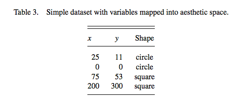
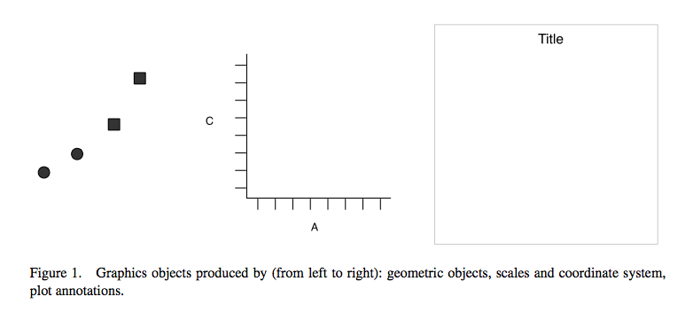
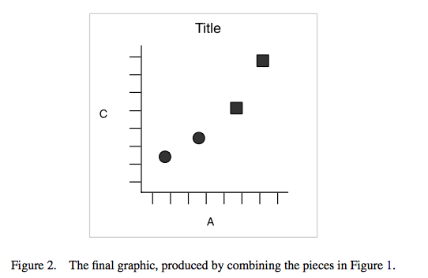
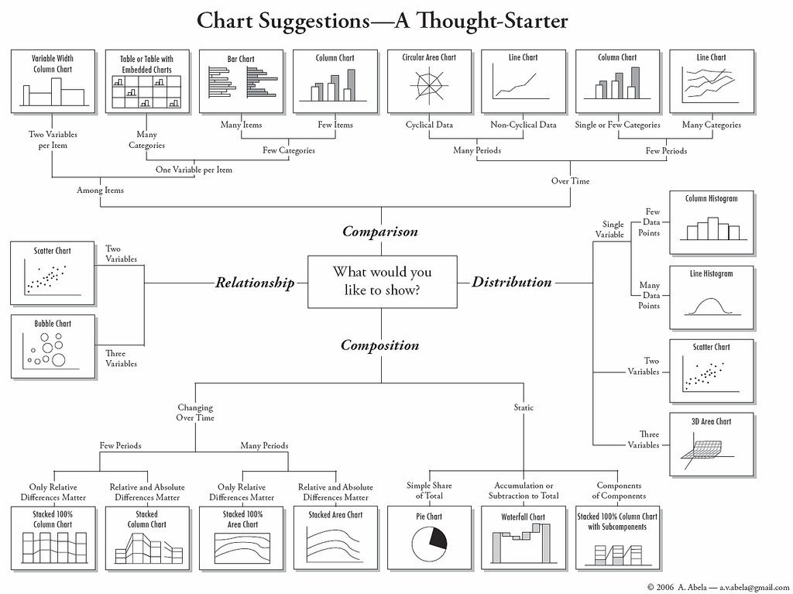
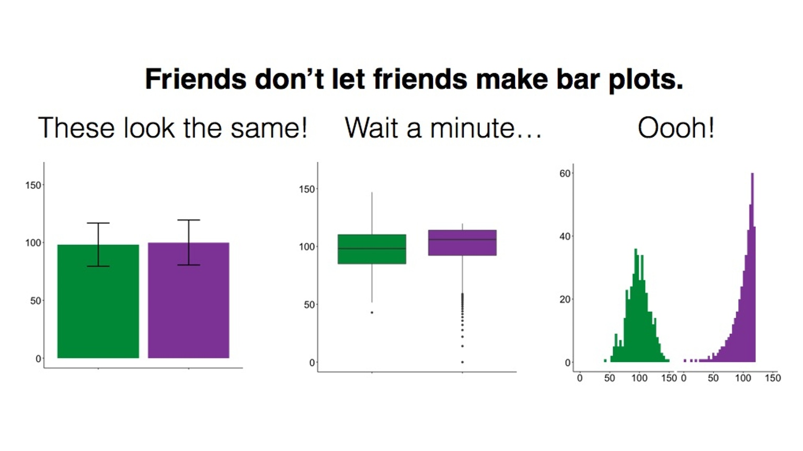
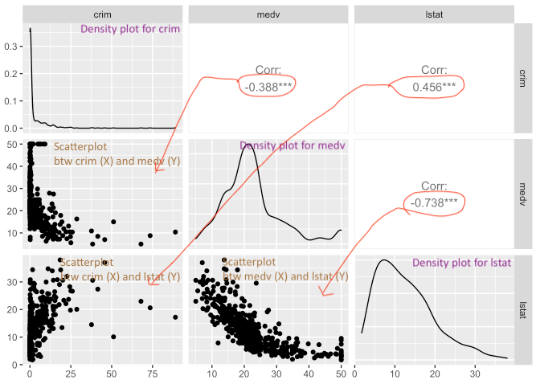
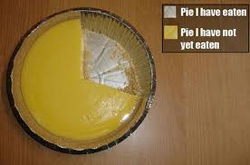

## Introducción

Una imagen vale más que mil palabras; esta idea básica también se aplica a la presentación e interpretación de datos. De hecho, se ha producido un cambio creciente en el análisis de datos hacia enfoques más visuales tanto para la interpretación como para la difusión del análisis numérico. Parte de la nueva revolución de los datos consiste en la mezcla de ideas procedentes de la visualización del análisis estadístico y el diseño visual. De hecho, la visualización de datos es una de las áreas de desarrollo más interesantes en este campo.

Unos buenos gráficos no solo ayudan a los investigadores a hacer que sus datos sean más fáciles de entender para el público en general, sino que también son una forma útil de comprender los datos nosotros mismos. En muchos sentidos, a menudo es una forma más intuitiva de comprender los patrones de nuestros datos que intentar examinar los resultados numéricos presentados en forma de tabla.

Investigaciones recientes, de hecho, han revelado que los artículos con buenos gráficos se perciben en general como más claros e interesantes, y sus autores se perciben como más inteligentes (véase [esta presentación](https://vimeo.com/181771433)).

Al igual que con otros aspectos de R, hay una serie de funciones que forman parte de la instalación básica que se pueden utilizar para producir gráficos. Sin embargo, estas ofrecen posibilidades limitadas para la creación de gráficos. De ahí, que haya habido varios paquetes desarrollados para potenciar el análisis visual de datos.

El paquete que utilizaremos a lo largo de este tutorial es probablemente el más conocido y popular para estos efectos: `ggplot2`. El objetivo de `ggplot2` es implementar la [gramática de los gráficos](http://www.springer.com/statistics/computational+statistics/book/978-0-387-24544-7). El paquete `ggplot2` cuenta con una excelente [documentación](http://ggplot2.org/) en línea y se está convirtiendo en un estándar del sector en algunas áreas. [Aquí](https://medium.com/bbc-visual-and-data-journalism/how-the-bbc-visual-and-data-journalism-team-works-with-graphics-in-r-ed0b35693535), por ejemplo, puedes leer cómo lo utiliza la BBC como parte de su servicio de noticias.

Si aún no tienes el paquete instalado (compruébalo), deberás hacerlo utilizando la función `install.packages()`. A continuación, deberás cargar el paquete.

```{r}

library(ggplot2) 

```

La gramática de gráficos en la que se basa este paquete define varios componentes de un gráfico. Algunos de los más importantes son:

\-**Los datos**: Para utilizar `ggplot2`, los datos deben almacenarse como un marco de datos o tibble.

\-**Las geometrías**: Describen los objetos que representan los datos (por ejemplo, puntos, líneas, polígonos, etc.). Esto es lo que se dibuja. Y se pueden tener varios tipos diferentes superpuestos entre sí en la misma visualización.

\-**La estética**: Describe las características visuales que representan los datos (por ejemplo, posición, tamaño, color, forma, transparencia).

\-**Facetas**: describen cómo se dividen los datos en subconjuntos y se muestran como múltiples gráficos pequeños.

\-**Estadísticas**: describen las transformaciones estadísticas que suelen resumir los datos.

Vayamos paso a paso.

## Anatomía de un gráfico

Básicamente, la filosofía que subyace a esto es que todos los gráficos están compuestos por capas. El paquete `ggplot2` se basa en la gramática de los gráficos, la idea de que se puede construir cualquier gráfico a partir de los mismos componentes básicos: un conjunto de datos, un conjunto de geometrías (marcas visuales que representan puntos de datos) y un sistema de coordenadas.

Veamos este ejemplo (tomado de *Wickham, H. (2010). A layered grammar of graphics. Journal of Computational and Graphical Statistics, 19(1), 3-28.*)

Tenemos una tabla como esta:



A continuación, querrás trazar esto. Para ello, debes crear un gráfico que combine las siguientes capas:



El resultado final será el siguiente gráfico:



Veamos cómo queda esto en un gráfico.

Echemos un vistazo a algunos datos sobre las [prohibiciones de acceso a los estadios](https://www.gov.uk/government/publications/football-related-arrests-and-banning-orders-england-and-wales-season-2016-to-2017/football-related-arrests-and-banning-order-statistics-england-and-wales%20-2016-to-2017-season) de diferentes clubes de fútbol.

Primero hay que leer los datos. Estos datos los tenemos depositados en un sitio web y se pueden descargar con el siguiente código:

```{r}
#| message: false
#| warning: false
# Cargar la biblioteca readr e importar los datos utilizando la función read_csv().
library(readr)
fbo <- read_csv("https://raw.githubusercontent.com/eonk/dar_book/main/datasets/FootbalBanningOrders.csv")

```

Una cosa que mencionamos en el primer capítulo son las convenciones para nombrar objetos. Esto también se aplica a los nombres de las variables (es decir, los nombres de las columnas) dentro de los datos. Si observas el marco de datos *fbo*, ya sea con la función `View()` o imprimiendo los nombres de las columnas con la función `names()`, verás que este conjunto de datos incumple ese requisito:

```{r}
names(fbo)
```

Para solucionar esto, podemos utilizar una función llamada `clean_names()` que se encuentra dentro del paquete `janitor`. Esta función sustituirá cualquier espacio por un guión bajo y también convertirá las mayúsculas en minúsculas. ¡Mucho más ordenado!

```{r}
#| message: false
#| warning: false
library(janitor)
fbo <- clean_names(fbo)
```

Imprime de nuevo los nombres para ver el cambio.

```{r}
names(fbo)
```

Ahora exploremos la cuestión del número de órdenes de prohibición para clubes de diferentes ligas. Pero, como primer paso, representemos gráficamente el número de órdenes de prohibición para cada club. Construyamos este gráfico:

```{r}
ggplot(data = fbo, aes(x = club_supported, y=banning_orders)) + #data
geom_point() + #geometry
theme_bw() #backgroud coordinate system
```

La primera línea anterior inicia un gráfico llamando a la función `ggplot()` e introduciendo los datos en ella. Debe nombrar su conjunto de datos con el argumento `data` y, a continuación, dentro del comando `aes()`, pasar las variables específicas que deseas representar gráficamente. En este caso, solo queremos ver la distribución de una variable, las órdenes de prohibición, en el eje y, y representaremos gráficamente el club apoyado en el eje x.

La segunda línea es donde añadimos la *geometría*. Aquí es donde le indicamos a R cómo queremos que sea el gráfico. En este caso, indicamos que queremos que sean puntos utilizando `geom_points`. Puedes ver una lista de todas las geometrías posibles [aquí](https://ggplot2.tidyverse.org/reference/).

La tercera línea es donde podemos ajustar la visualización del gráfico. Aquí he utilizado `theme_bw()`, que es un tema muy limpio y agradable. Puedes probar con otros temas. Para obtener una lista de temas, también puedes consultar el recurso [aquí](https://ggplot2.tidyverse.org/reference/ggtheme.html). Si quieres más variedad, puedes explorar el paquete [`ggthemes`](https://yutannihilation.github.io/allYourFigureAreBelongToUs/ggthemes/).

```{r}
ggplot(data = fbo, aes(x = club_supported, y=banning_orders)) + #data
geom_point() + #geometry
theme_dark() #backgroud coordinate system
```

Cambiar el tema no es lo único que se puede hacer con el tercer elemento. Por ejemplo, aquí no se pueden leer realmente las etiquetas de los ejes, porque se superponen entre sí. Una solución sería girar las etiquetas de los ejes 90 grados, con el siguiente código: `axis.text.x = element_text(angle = 90, hjust = 1)`. Este código se pasa al argumento `theme`.

```{r}
ggplot(data = fbo, aes(x = club_supported, y=banning_orders)) + 
  geom_point() + 
  theme(axis.text.x = element_text(angle = 90, hjust = 1))                                   
```

Vale, ¿y si no queremos que sean puntos, sino un gráfico de barras?

```{r}
ggplot(data = fbo, aes(x = club_supported, y=banning_orders)) + #data
geom_bar(stat = "identity") + #geometry
theme(axis.text.x = element_text(angle = 90, hjust = 1)) #backgroud coordinate system
```

Quizás hayas notado que aquí pasamos un argumento `stat = "identity"` a la función `geo_bar()`. Esto se debe a que puedes tener un gráfico de barras en el que la altura de la barra muestra la frecuencia (`stat = "count"`) o en el que la altura se toma de una variable de tu marco de datos (`stat = "identity"`). Aquí hemos especificado un valor y (altura) como la variable *banning_orders*.

¡Esto es genial! Pero, ¿y si me gustan ambos?

Bueno, esta es la belleza del enfoque por capas de `ggplot2`. ¡Puedes superponer tantas geometrías como desees! XD

```{r}
ggplot(data = fbo, aes(x = club_supported, y=banning_orders)) + #data
  geom_bar(stat = "identity") +                                 #geometry 1 
  geom_point() +                                                #geometry 2
  theme(axis.text.x = element_text(angle = 90, hjust = 1))      #backgroud coordinate system
```

También puedes añadir otras cosas. Por ejemplo, puedes añadir el número medio de *órdenes de prohibición*:

```{r}
ggplot(data = fbo, aes(x = club_supported, y=banning_orders)) + #data
geom_bar(stat = "identity") + #geometría 1 
geom_point() + #geometría 2
geom_hline(yintercept = mean(fbo$banning_orders)) + #línea media
theme(axis.text.x = element_text(angle = 90, hjust = 1)) #sistema de coordenadas de fondo
```

¡Esto es básicamente todo lo que necesitas saber para crear un gráfico! Hasta ahora hemos introducido mucho código, parte del cual quizá no entiendas del todo. No te preocupes demasiado, solo queríamos darte una introducción rápida a algunas de las posibilidades. Más adelante en la sesión, volveremos a algunas de estas funciones de forma más pausada. Lo importante de esta sección es comprender los elementos básicos de la gramática de los gráficos.

## ¿Qué gráfico debo utilizar?

Hay muchos aspectos que hay que tener en cuenta a la hora de elegir qué gráfico utilizar para representar visualmente los datos. Existen algunas pautas sobre buenas prácticas, pero al final hay que tener en cuenta qué es lo mejor para los datos. ¿Qué se quiere mostrar? ¿Qué gráfico comunicará mejor el mensaje? ¿Se trata de una comparación entre grupos? ¿Es la distribución de frecuencias de una variable?

Como orientación, puedes utilizar la siguiente [hoja de referencia, tomada del blog Flowingdata de Nathan Yau](https://flowingdata.com/2009/01/15/flow-chart-shows-you-what-chart-to-use/):



Sin embargo, ten en cuenta que esto es más bien una guía, destinada a orientarte en la dirección correcta. Hay muchas formas de visualizar los mismos datos y, a veces, es posible que quieras experimentar con algunas de ellas para ver cuáles son las diferencias.

También hay una gran cantidad de investigaciones sobre lo que funciona a la hora de mostrar información cuantitativa. El libro clásico es [The Visual Display of Quantitative Information](https://www.edwardtufte.com/book/the-visual-display-of-quantitative-information/) de Edward Tufte, pero desde entonces hay muchos otros investigadores que se centran en los enfoques para mostrar datos. Dos libros útiles que puede consultar son [Show me the numbers](https://www.analyticspress.com/smtn.php) de Stephen Few y [The Truthful Art](https://www.pearson.com/en-us/subject-catalog/p/the-truthful-art-data-charts-and-maps-for-communication/P200000008947/9780133440539) de Alberto Cairo . Claus Wilke también está elaborando un libro de texto disponible gratuitamente [en Internet](https://clauswilke.com/dataviz/). Estos autores suelen ofrecer recomendaciones sobre qué utilizar (y qué no utilizar) en determinados contextos. Particularmente recomendable es las segunda edición de [Data Visualization](https://socviz.co) de Kieran Healey que profundiza en el uso de `ggplot2`.

Por ejemplo, la mayoría de los expertos en visualización de datos coinciden en que no se deben utilizar gráficos en 3D a menos que la tercera dimensión tenga algún significado. Por lo tanto, utilizar gráficos 3D solo con fines decorativos, como en [este caso](https://mir-s3-cdn-cf.behance.net/project_modules/disp/2505dd10837923.56030acd2ef20.jpg), suele estar mal visto. Sin embargo, hay casos en los que incluir una tercera dimensión es fundamental para comunicar los resultados. Véase este [ejemplo](http://www.visualisingdata.com/2015/03/when-3d-works/).

A menudo, también se menosprecian ciertos tipos de gráficos. Por ejemplo, el [*gráfico circular*](https://en.wikipedia.org/wiki/Pie_chart) es uno de ellos. A mucha gente (incluido el autor de esta monografía) le disgustan los gráficos circulares, véase, por ejemplo, [aquí](http://www.storytellingwithdata.com/blog/2011/07/death-to-pie-charts) o [aquí](http://www.businessinsider.com/pie-charts-are-the-worst-2013-6?IR=T). Si quieres mostrar proporciones, las investigaciones indican que un gráfico circular cuadrado tiene más probabilidades de ser interpretado correctamente por los espectadores. Véase [aquí](https://eagereyes.org/blog/2016/a-reanalysis-of-a-study-about-square-pie-charts-from-2009).

Además, en algunos casos, los gráficos de barras (si se utilizan para visualizar variables cuantitativas) pueden ocultar características importantes de los datos y puede que no sean el medio más adecuado para realizar comparaciones:



Esto ha dado lugar a una [campaña en Kickstarter](https://www.kickstarter.com/projects/1474588473/barbarplots/description) para prohibir los gráficos de barras...

Por lo tanto, elegir el gráfico adecuado y cómo diseñar los diferentes elementos de un gráfico es, en cierto modo, un arte que requiere práctica y un buen conocimiento de la literatura sobre visualización de datos. Aquí solo podemos ofrecerte una introducción a algunas de estas cuestiones. Al final del capítulo, también destacaremos recursos adicionales que quizás te interese explorar por tu cuenta.

Una consideración importante es que el gráfico que utilice depende de los datos que esté representando, así como del mensaje que desee transmitir con el gráfico, el público al que va dirigido e incluso el formato en el que se presentará (un sitio web, un informe impreso, una presentación de PowerPoint, etc.). Así, por ejemplo, volviendo de nuevo a la diferencia entre el número de órdenes de prohibición entre clubes de diferentes ligas, ¿cuáles son algunas formas de representar estos datos?

Una sugerencia es crear un histograma para cada uno. Puedes utilizar la opción `facet_wrap()` de ggplot para dividir los gráficos por una variable de agrupación. Por ejemplo, para crear un histograma de órdenes de prohibición, escribe:

```{r}
#| message: false
ggplot(data = fbo, aes(x = banning_orders)) + 
geom_histogram()
```

Ahora, para dividirlo por *league_of_the_club_supported*, utiliza `facet_wrap()` en la capa de coordenadas del gráfico.

```{r}
#| message: false
ggplot(data = fbo, aes(x = banning_orders)) + 
geom_histogram() + 
facet_wrap (~league_of_the_club_supported)
```

Bueno, se puede ver que hay una distribución diferente en cada liga. Pero, ¿es fácil compararlas? ¿Quizás otro enfoque lo haría más fácil? Personalmente, me gustan los diagramas de caja (los explicaremos con más detalle a continuación) para mostrar la distribución. Así que probemos:

```{r}
ggplot(data = fbo, aes(x = league_of_the_club_supported, y = banning_orders)) + 
geom_boxplot() 
```

Esto facilita considerablemente la comparación, ¿verdad? ¡Pero el orden es extraño! ¿Recuerdas que hablamos de factores en semanas anteriores? Bueno, lo bueno de los factores es que podemos ordenarlos en su orden natural. Si no especificamos un orden, R utiliza el orden alfabético. Así que reordenemos nuestro factor. Para ello, especificamos los niveles en el orden en que queremos que se incluyan dentro del factor. Utilizamos el código que introdujimos la semana pasada para hacerlo.

```{r}
fbo$league_of_the_club_supported <- factor(fbo$league_of_the_club_supported, levels = c("Premier League", "Championship", "League One", "League Two", "Other clubs"))
```

¡Y ahora vuelve a crear el gráfico!

```{r}
ggplot(data = fbo, aes(x = league_of_the_club_supported, y = banning_orders)) + 
geom_boxplot() 
```

¡Esto es genial! Podemos ver que cuanto más alta es la liga, más órdenes de prohibición hay. ¿Alguna idea de por qué?

Ahora veremos algunos ejemplos de cómo crear gráficos utilizando el paquete `ggplot2`, deteniéndonos un poco más en cada uno de ellos.

## Visualización de variables numéricas: histogramas

Los histogramas son una forma útil de representar variables cuantitativas de forma visual.

Como se ha mencionado anteriormente, en este curso haremos hincapié en el uso de la función `ggplot()`. Con `ggplot()` se empieza con un lienzo en blanco y se van añadiendo capas específicas. La función `ggplot()` puede especificar el conjunto de datos y la estética (las características visuales que representan los datos).

Para obtener los datos que vamos a utilizar aquí, cargua el paquete `MASS` y, a continuación, invoca los datos *Boston* en su entorno.

```{r}
library(MASS)
data(Boston)
```

Este paquete tiene un conjunto de datos llamado *Boston*. Este contine datos sobre el valor de las viviendas en los suburbios de Boston (EE. UU.). Para acceder al libro de códigos (donde se pueden consultar las variables), utiliza la función `?`, `?Boxton`.

Bien, vamos a crear un gráfico sobre la variable que representa la tasa de criminalidad per cápita por ciudad (*crim*).

Si quieres crear un histograma con la función `ggplot`, utiliza el siguiente código:

```{r}
#| message: false
ggplot(Boston, aes(x = crim)) + 
geom_histogram()
```

Como puedes ver, `ggplot` funciona de tal manera que puedes añadir una serie de especificaciones adicionales (capas, anotaciones). En este sencillo gráfico, la función `ggplot` simplemente asigna *crim* como la variable que se va a mostrar (como uno de los **elementos estéticos**) y el conjunto de datos. A continuación, se añade `geom_histogram` para indicar a R que se desea que esta variable se represente como un histograma. Más adelante veremos qué otras cosas se pueden añadir.

Un histograma consiste simplemente en colocar los casos en "compartimentos" y luego crear una barra para cada compartimento. Se puede considerar como una *distribución de frecuencias agrupadas visualmente*. El código que hemos utilizado hasta ahora ha utilizado un ancho de compartimento de rango de tamaño/30, como R nos ha recordado amablemente en la salida. Pero puedes modificar este parámetro si deseas obtener una imagen más aproximada o más detallada. De hecho, siempre debes probar diferentes especificaciones del ancho de compartimento hasta encontrar uno que cuente toda la historia de forma concisa.

```{r}
ggplot(Boston, aes(x = crim)) +
geom_histogram(binwidth = 1) 
```

Como puedes ver, podemos pasar argumentos a los `geoms`. Aquí estamos cambiando el tamaño de los bins (para más detalles sobre otros argumentos, puede consultar los archivos de ayuda). Al utilizar un bin-width de 1, estamos creando esencialmente una barra por cada unidad de aumento en la tasa porcentual de delincuencia. Seguimos viendo que la mayoría de las ciudades tienen un nivel de delincuencia muy bajo.

Sumemos el número de ciudades con un valor inferior a 1 en la tasa de criminalidad per cápita. Para ello, utilizamos la función `sum`, especificando que solo nos interesa sumar los casos en los que el valor de la variable *crim* es inferior a 1.

```{r}
sum(Boston$crim < 1)
```

Podemos ver que la gran mayoría de las ciudades, 332 de 506, tienen una tasa de criminalidad per cápita inferior al 1 %. Pero también podemos ver que hay algunas ciudades que tienen una alta concentración de delitos. Esta es una característica espacial de la delincuencia: tiende a concentrarse en determinadas zonas y lugares. Se puede ver cómo podemos utilizar visualizaciones para mostrar los datos y obtener una primera impresión de cómo pueden estar distribuidos.

Al trazar una variable continua, nos interesan las siguientes características:

-   **Asimetría**: si la distribución está sesgada hacia la derecha o hacia la izquierda, o si sigue una forma más simétrica.
-   **Valores atípicos**: ¿Hay uno o más valores que parecen muy diferentes a los demás?
-   **Multimodalidad**: ¿Cuántos picos tiene la distribución? Más de un pico puede indicar que la variable está midiendo diferentes grupos.
-   **Imposibilidades u otras anomalías**: valores que son simplemente poco realistas teniendo en cuenta lo que estamos midiendo (por ejemplo, alguien con una edad de 1000 años). A veces se puede encontrar una distribución de datos con un recuento de frecuencias muy alto (e inverosímil) para un valor concreto. Quizás se mida la edad y se tenga un gran número de casos de 99 años (que suele ser un código utilizado para los datos que faltan).
-   **Dispersión**: nos da una idea de la variabilidad de nuestros datos.

A menudo visualizamos los datos porque queremos comparar distribuciones. **La mayor parte del análisis de datos consiste en hacer comparaciones**. Vamos a explorar si la distribución de la delincuencia en este conjunto de datos es diferente en las zonas menos prósperas. La variable *medv* mide en el conjunto de datos de Boston el valor medio de las viviendas ocupadas por sus propietarios. A efectos de esta ilustración, quiero dicotomizar\[\^03-visualización-4\] esta variable, para crear un grupo de ciudades con valores particularmente bajos frente a todas las demás. Para obtener más detalles sobre cómo recodificar variables con R, puede leer las secciones pertinentes en [Quick R](http://www.statmethods.net/management/variables.html) o en [R Cookbook](http://www.cookbook-r.com/Manipulating_data/Recoding_data/). Pronto aprenderemos más sobre la recodificación y la transformación de variables en R.

¿Cómo podemos crear una variable categórica basada en la información de una variable cuantitativa? Veamos el siguiente código y prestemos atención a él y a la explicación que aparece a continuación.

```{r}
Boston$lowval[Boston$medv <= 17.02] <- "Valor bajo" 
Boston$lowval[Boston$medv > 17.02] <- "Valor más alto"
```

En primer lugar, le indicamos a R que cree un nuevo vector (*lowval*) en el conjunto de datos de Boston. A este vector se le asignará el valor de carácter "valor bajo" cuando se cumpla la condición entre corchetes. Es decir, estamos diciendo que siempre que el valor de *medv* sea inferior a 17,02, la nueva variable *lowval* será igual a "Valor bajo". He elegido 17,02 porque es el primer cuartil de *medv* (prueba este código `summary(Boston$medv)` y busca 17,02). A continuación, le indicamos a R que, cuando el valor sea superior a 17,02, asignaremos esos casos a una nueva categoría textual llamada "Valor más alto".

La variable que hemos creado era un vector de caracteres (como podemos ver si ejecutamos la función `class`). Por lo tanto, vamos a transformarla en un factor utilizando la función `as.factor` (muchas funciones diseñadas para trabajar con variables categóricas esperan un factor como entrada, no solo un vector de caracteres). Si volvemos a ejecutar la función `class`, veremos que hemos cambiado la variable original.

```{r}
class(Boston$lowval)
Boston$lowval <- as.factor(Boston$lowval)
class(Boston$lowval)
```

Ahora podemos generar el gráfico. Lo haremos utilizando **facetas**. Las facetas son otro elemento de la gramática de los gráficos, las utilizamos para definir subconjuntos de los datos que se representarán como múltiples grupos. En este caso, le pedimos a R que genere dos gráficos definidos por los dos niveles del factor que acabamos de crear.

```{r}
ggplot(Boston, aes(x = crim)) +
geom_histogram(binwidth = 1) +
facet_grid(lowval ~ .) 
```

Visualmente puede que no se vea muy bien, pero empieza a contar una historia. Podemos ver que hay una proporción considerablemente menor de ciudades con bajos niveles de delincuencia en el grupo de ciudades que tienen viviendas más baratas. Es una distribución más plana y menos sesgada. Se puede ver cómo la expresión `facet_grid()` le dice a R que cree el histograma de la variable mencionada en la función `ggplot` para los grupos definidos por la entrada categórica de interés (el factor *lowval*).

Podríamos hacer algunas cosas que tal vez ayuden a enfatizar la comparación, como, por ejemplo, añadir color a cada uno de los grupos.

```{r}
ggplot(Boston, aes(x = crim, fill = lowval)) +
geom_histogram(binwidth = 1) +
facet_grid(lowval ~ .) +
theme(legend.position = "none")
```

El argumento `fill` dentro de `aes` le indica a R qué variable debe asignar colores. Ahora, cada uno de los niveles (grupos) definidos por la variable *lowval* tendrá un color diferente. La instrucción `theme` que añadimos le indica a R que no coloque una leyenda en el gráfico explicando que el rojo es un valor más alto y el color verdoso es un valor más bajo. Ya podemos verlo sin necesidad de una etiqueta.

En lugar de utilizar facetas, podríamos superponer los histogramas con un poco de transparencia. Las transparencias funcionan mejor cuando se proyectan en pantallas que en documentos impresos, así que tenlo en cuenta a la hora de decidir si utilizarlas en lugar de facetas. El código es el siguiente:

```{r}
#| message: false
ggplot(Boston, aes(x = crim, fill = lowval)) + 
geom_histogram(position = "identity", alpha = 0.4)
```

En el código anterior, el argumento `fill` identifica de nuevo la variable factorial en el conjunto de datos que agrupa los casos. Además, `position = identity` indica a R que superponga las distribuciones y `alpha` solicita el grado de transparencia; un valor más bajo (por ejemplo, 0,2) será más transparente.

En este caso, parte del problema que tenemos es que la asimetría puede dificultar la apreciación de las diferencias. Cuando se trata de distribuciones asimétricas como esta, a veces es conveniente utilizar una transformación [^visualisation-2]. Volveremos a esto más adelante en este semestre. Por ahora, basta con decir que tomar el logaritmo de una variable asimétrica ayuda a reducir la asimetría y a ver los patrones con mayor claridad. Para visualizar un poco mejor las diferencias, podríamos pedir el logaritmo de la tasa de criminalidad per cápita. Observe que también añado una constante de 1 a la variable *crim*, para evitar valores NA en la variable recién creada si el valor en *crim* es cero (no se puede tomar el logaritmo de 0).

[^visualisation-2]: [Esta](http://tomhopper.me/2010/08/30/graphing-highly-skewed-data/) es una entrada de blog interesante sobre soluciones cuando se tienen datos muy sesgados.

```{r}
#| message: false
ggplot(Boston, aes(x = log10(crim + 1), fill = lowval)) +
geom_histogram(position = "identity", alpha = 0.4)
```

Ahora el gráfico es un poco más claro. Parece bastante evidente que la distribución de la delincuencia es muy diferente entre estos dos tipos de ciudades.

## Visualización de variables numéricas: gráficos de densidad

Para distribuciones más suaves, puedes utilizar un gráfico de densidad. Debes disponer de una cantidad considerable de datos para utilizarlos, ya que, de lo contrario, podrías acabar con mucho ruido no deseado. Veamos primero el gráfico de densidad única para todos los casos. Observa que lo único que hacemos es invocar un tipo diferente de `geom`:

```{r}
ggplot(Boston, aes(x = crim)) +
geom_density() 
```

En un gráfico de densidad, intentamos visualizar la distribución de probabilidad subyacente de los datos dibujando una curva continua adecuada. Así, en un gráfico de densidad, el área bajo las líneas suma 1 y el eje Y, vertical, nos da ahora la probabilidad estimada (supuesta) para los diferentes valores del eje X, horizontal. Esta curva se supone a partir de los datos y el método que utilizamos para esta suposición o estimación se denomina estimación de densidad del núcleo. Puedes obtener más información sobre los gráficos de densidad [aquí](https://serialmentor.com/dataviz/histograms-density-plots.html).

En este gráfico, podemos ver que hay una alta probabilidad estimada de observar una ciudad con una tasa de criminalidad per cápita cercana a cero y una baja probabilidad estimada de ver ciudades con altas tasas de criminalidad per cápita. Como puedes observar, proporciona una representación más suave de la distribución (en comparación con los histogramas).

También puedes utilizar esto para comparar la distribución de una variable cuantitativa entre los niveles de una variable categórica (factor) y, como antes, es posible que sea mejor tomar el logaritmo de variables sesgadas como la delincuencia:

```{r}
#Estamos mapeando "lowval" como la variable que colorea las líneas 
ggplot(Boston, aes(x = log10(crim + 1), colour = lowval)) + 
geom_density() 
```

O también se pueden utilizar transparencias:

```{r}
ggplot(Boston, aes(x = log10(crim + 1), fill = lowval)) + 
geom_density(alpha = .3)
```

¿Has notado la diferencia con los histogramas comparativos? Al utilizar gráficos de densidad, estamos reescalando para garantizar la misma área para cada uno de los niveles de nuestra variable de agrupación. Esto facilita la comparación de dos grupos que tienen frecuencias diferentes. Las áreas bajo la curva suman 1 para ambos grupos, mientras que en el histograma el área dentro de las barras representa el número de casos en cada uno de los grupos. Si tienes muchos más casos en un grupo que en el otro, puede resultar difícil hacer comparaciones o ver claramente la distribución del grupo con menos casos. Por lo tanto, esta es una de las razones por las que puede ser conveniente utilizar gráficos de densidad.

Los gráficos de densidad son una buena opción cuando se desea comparar hasta tres grupos. Si tienes muchos más grupos, es posible que desees considerar otras alternativas. Una de ellas es el **gráfico de línea de cresta**, también conocido como gráfico de Joy Division (ya que quedó inmortalizado en la portada de uno de sus álbumes):

 

Este tipo de visualización se puede generar con el paquete `ggridges`. Antes de dicotomizar la variable *medv* de forma manual, podemos utilizar métodos más directos para dividir las variables numéricas en varias categorías utilizando la información que ya contienen. Supongamos que queremos dividir *medv* en deciles. Para ello, podríamos utilizar la función `mutate` de `dplyr`.

```{r}
#| message: false
library(dplyr)
Boston <- mutate(Boston, dec_medv = ntile(medv, 10))
```

La función `mutate` añade una nueva variable a nuestro objeto de conjunto de datos existente. Vamos a llamar a esta variable *dec_medv* porque vamos a dividir *medv* en diez grupos de igual tamaño (este nombre es arbitrario, puedes llamarla como quieras). Para ello, utilizaremos la función `ntile` como argumento dentro de `mutate`. Definiremos la nueva variable *dec_medv* explicando a R que esta variable será el resultado de pasar la función `ntile` a *medv*. Para que `ntile` divida *medv* en 10, pasamos este valor como argumento a la función. Para que se almacene el resultado de ejecutar `mutate`, lo asignamos al objeto *Boston*.

Comprueba los resultados:

```{r}
table(Boston$dec_medv)
```

Ahora podemos utilizar esta nueva variable para ilustrar el uso del paquete `ggridge`. En primer lugar, deberá instalar este paquete y, a continuación, cargarlo. Verás que lo único que hace este paquete es ampliar la funcionalidad de `ggplot2` añadiendo un nuevo tipo de `geom`. Aquí, la variable que define los grupos debe ser un factor, por lo que le indicaremos a `ggplot` que trate *dec_medv* como un factor utilizando `as.factor`. Usar `as.factor` de esta manera nos ahorra tener que crear otra variable más que vamos a almacenar como factor. Aquí no estamos creando una nueva variable, solo le estamos indicando a R que trate esta variable numérica *como si* fuera un factor. Asegúrate de comprender esta diferencia.

```{r}
#| message: false
library(ggridges)
ggplot(Boston, aes(x = log10(crim + 1), y = as.factor(dec_medv))) + geom_density_ridges()
```

Podemos ver que la distribución de la delincuencia es particularmente diferente cuando nos centramos en los tres deciles con el nivel de ingresos más bajo. Para obtener más detalles sobre este tipo de gráfico, puede leer la [vignette](https://cran.r-project.org/web/packages/ggridges/vignettes/introduction.html) de este paquete.

## Visualización de variables numéricas: diagramas de caja

Los [diagramas de caja](http://tomhopper.me/2014/07/04/the-most-useful-data-plot-youve-never-used/) son una forma interesante de presentar el resumen de 5 números (el valor mínimo, el primer cuartil, la mediana, el tercer cuartil y el valor máximo de un conjunto de números) de forma visual. Si queremos utilizar `ggplot` para trazar una sola variable numérica, necesitamos un código complicado, ya que `ggplot` asume que se desea un diagrama de caja para comparar varios grupos. Por lo tanto, necesitamos establecer algún valor arbitrario para la variable de agrupación y también es posible que queramos eliminar los marcadores y las etiquetas del eje x.

Para esta ilustración, voy a mostrar la distribución del valor mediano de la propiedad en las distintas ciudades en lugar de la delincuencia.

```{r}
ggplot(Boston, aes(x = 1, y = medv)) + 
geom_boxplot() +
scale_x_continuous(breaks = NULL) + #elimina los marcadores del eje x
theme(axis.title.x = element_blank())
```

Sin embargo, los diagramas de caja cobran vida cuando se utilizan para comparar la distribución de una variable cuantitativa entre varios grupos. Veamos la distribución de *log(delitos)* entre zonas más baratas y más caras:

```{r}
#| message: false
ggplot(Boston, aes(x = lowval, y=log10(crim + 1))) +
geom_boxplot()
```

Con un diagrama de caja como este, se puede ver de inmediato que la mayor parte de las zonas más baratas son muy diferentes de la mayor parte de las zonas más caras. El primer cuartil de la distribución de las zonas bajas coincide aproximadamente con el punto en el que empezamos a ver **valores atípicos** para las zonas más caras.

Esto puede ser aún más útil cuando se tienen varios grupos. Probemos con un ejemplo utilizando el conjunto de datos *BCS0708*. Se trata de un conjunto de datos de la Encuesta Británica sobre Delincuencia de 2007/08. Puede utilizar el código siguiente para descargarlo.

```{r}
#Creamos un objeto de marco de datos leyendo los datos del archivo webaddress.csv
BCS0708<-read.csv("https://raw.githubusercontent.com/eonk/dar_book/main/datasets/BCS0708.csv")
```

Este conjunto de datos contiene una variable cuantitativa que mide el nivel de preocupación por la delincuencia (*tcviolent*): las puntuaciones altas representan niveles altos de preocupación. Vamos a ver cómo cambia la puntuación de esta variable según el origen étnico (*ethgrp2*).

```{r}
#| message: false
#| warning: false
#Un diagrama de caja comparativo del origen étnico y la preocupación por los delitos violentos
ggplot(BCS0708, aes(x = ethgrp2, y = tcviolent)) +
geom_boxplot()
```

Bien. Pero podría ser mejor. Para empezar, podríamos ordenar los grupos a lo largo del eje X para que los grupos étnicos se posicionen según su nivel de preocupación. En segundo lugar, tal vez queramos excluir la información de los casos NA sobre etnia (representados por una línea plana).

```{r}
#Un diagrama de caja comparativo más bonito (excluyendo NA y reordenando la variable X)
ggplot(filter(BCS0708, !is.na(ethgrp2) & !is.na(tcviolent)), 
aes(x = reorder(ethgrp2, tcviolent, FUN = median), y = tcviolent)) +
geom_boxplot ()
```

La función `filter` de `dplyr` utiliza un argumento lógico para indicar a R que solo utilice los casos que no tengan valores NA en las dos variables que estamos utilizando. El signo de exclamación seguido de `is.na` y luego el nombre de una variable es la forma en que R dice "lo contrario de NA para la variable especificada". Así que, en esencia, le estamos diciendo a R que solo mire los datos que no son NA en estas variables. La función `reorder`, por otro lado, le pide a R que reordene los niveles de etnia según el valor mediano de preocupación por los delitos violentos. Dado que estamos utilizando esas funciones *dentro* de la función `ggplot`, este subconjunto y este reordenamiento (al igual que con `as.factor` anteriormente) no introducen cambios permanentes en el conjunto de datos original. Si prefieres reordenar según la media, solo tiene que cambiar ese parámetro después de la opción `FUN` (por ejemplo, `FUN = mean`).

## Exploración de las relaciones entre dos variables cuantitativas: diagramas de dispersión

Hasta ahora hemos visto cómo se pueden utilizar histogramas, diagramas de densidad y diagramas de caja para representar variables numéricas y comparar grupos en relación con variables numéricas. Dicho de otro modo, se pueden utilizar histogramas comparativos, diagramas de densidad o diagramas de caja para evaluar la relación entre una variable numérica y una variable categórica (la variable que define los grupos). ¿Cómo se explora la relación entre dos variables numéricas?

A la hora de analizar la relación entre dos variables cuantitativas, nada supera al **gráfico de dispersión**. [Este](http://www.datavis.ca/papers/friendly-scat.pdf) es un artículo muy interesante sobre la historia del gráfico de dispersión.

Un diagrama de dispersión representa una variable en el eje Y y otra en el eje X. Normalmente, si tienes en mente una variable de resultado o respuesta clara, la colocas en el eje Y y la variable explicativa en el eje X.

Así es como se crea un diagrama de dispersión con `ggplot()`:

```{r}
#Un diagrama de dispersión del crimen frente al valor medio de las propiedades
ggplot(Boston, aes(x = medv, y = crim)) +
geom_point()
```

Cada punto representa un caso de nuestro conjunto de datos y las coordenadas asociadas a él en este plano bidimensional vienen dadas por su valor en las variables Y (delincuencia) y X (valor medio de las propiedades).

¿Qué se busca en un diagrama de dispersión? Se quiere evaluar los patrones globales y locales, así como las desviaciones. Podemos ver claramente que, con niveles bajos de *medv*, hay una mayor probabilidad en estos datos de que el nivel de delincuencia sea más alto. Una vez que el valor medio de la propiedad alcanza los 30 000 dólares, el nivel de delincuencia es casi nulo en todas las ciudades. Hasta aquí todo bien, y sin duda predecible. La primera razón por la que miramos los diagramas de dispersión es para comprobar nuestra hipótesis (por ejemplo, zonas más pobres, más delincuencia).

Sin embargo, parece que ocurre algo extraño cuando el valor medio de la propiedad ronda los 50 000 dólares. De repente, la variabilidad de la delincuencia aumenta. Parece que algunas de las zonas más caras también presentan un nivel de delincuencia bastante elevado. De hecho, hay una ruptura considerable en la distribución. ¿Qué está pasando? Sinceramente, no tengo ni idea. Pero el patrón en el nivel más alto de valor de las propiedades es realmente extraño, demasiado abrupto para ser natural.

Esta es la segunda razón por la que conviene visualizar los datos antes de hacer nada más. Ayuda a detectar anomalías aparentes. Digo que se trata de una anomalía porque la ruptura en el patrón es bastante notable y abrupta. Es difícil pensar en un proceso natural que genere este aumento radical y repentino de la delincuencia una vez que el valor medio de las propiedades alcanza la marca de los 50 000 dólares. Si estuvieras analizando esto en la realidad, querrías saber qué es lo que realmente impulsa este patrón (por ejemplo, averiguar sobre la recopilación de datos originales, el libro de códigos, etc.): ¿quizás el valor medio máximo se limitó a 50 000 dólares y estamos viendo esto como un aumento dramático cuando el panorama es más complejo? Por ahora, vamos a dejar esto así.

Una de las cosas que se pueden observar en un diagrama de dispersión es que, incluso con un conjunto de datos pequeño como este, con solo unos 500 casos, el **sobreploteo** puede ser un problema. Cuando hay muchos casos con valores similares (o, lo que es peor, iguales), es difícil distinguirlos. Imagina que solo hay un caso con una combinación particular de valores X e Y. ¿Qué ves? Un único punto. Ahora imagina que tienes 500 casos con esa misma combinación de valores para X e Y. ¿Qué ves? Sigue siendo un único punto. Hay varias formas de lidiar con el sobreploteo. Una posibilidad es añadir algo de **transparencia** a los puntos:

```{r}
ggplot(Boston, aes(x = medv, y = crim)) +
geom_point(alpha=.4) #tendrá que probar diferentes valores para alpha
```

Por qué esto es un problema puede resultar más evidente con los `datos BCS0708`. Compare los dos gráficos:

```{r}
#| message: false
#| warning: false
ggplot(BCS0708, aes(x = age, y = tcviolent)) +
geom_point()
```

```{r}
#| message: false
#| warning: false
ggplot(BCS0708, aes(x = age, y = tcviolent)) +
geom_point(alpha=.2)
```

El segundo gráfico nos da una mejor idea de dónde parecen concentrarse las observaciones, algo que no podíamos ver con el primero.

El sobreploteo puede producirse cuando una medida continua se redondea a una unidad conveniente. Esto tiene el efecto de cambiar una variable continua en una variable ordinal discreta. Por ejemplo, la edad se mide en años y el peso corporal se mide en libras o kilogramos. La edad es una variable discreta, solo toma valores enteros. Por eso se ven los puntos alineados en líneas verticales paralelas. Esto también contribuye al sobreploteo en este caso.

Una forma de abordar este problema concreto es mediante el **jittering**. El jittering consiste en añadir ruido aleatorio a los datos para evitar el sobreploteo en los gráficos estadísticos. En `ggplot`, una forma de hacerlo es pasando un argumento a `geom_point` especificando que se desea aplicar jittering a los puntos. Esto introducirá algo de ruido aleatorio para que la *edad* parezca menos discreta.

```{r}
#| message: false
#| warning: false
ggplot(BCS0708, aes(x = age, y = tcviolent)) +
geom_point(alpha=.2, position="jitter") 
#Alternativamente, se puede sustituir geom_point() por geom_jitter(), en cuyo caso no es necesario especificar la posición
```

Otra alternativa para resolver el sobreploteo es **agrupar los datos** en rectángulos y asignar la densidad de los puntos al relleno del color de los rectángulos.

```{r}
#| message: false
#| warning: false
ggplot(BCS0708, aes(x = age, y = tcviolent)) + 
stat_bin2d()
```

```{r}
#| message: false
#| warning: false
#Lo mismo, pero con parámetros gráficos más agradables
ggplot(BCS0708, aes(x = age, y = tcviolent)) +
stat_bin2d(bins=50) + #al aumentar el número de compartimentos obtenemos más granularidad
scale_fill_gradient(low = "blue", high = "red") #cambiar colores
```

Lo que hace es crear cuadros dentro del plano bidimensional; contar el número de puntos dentro de esos cuadros; y asignar un color al cuadro en función de la densidad de puntos dentro de cada uno de los rectángulos.

Al observar diagramas de dispersión, a veces resulta útil resumir las relaciones mediante el trazado de líneas. Por ejemplo, se podría añadir una línea que represente la **media condicional**. Una media condicional es simplemente la media de la variable Y para cada valor de X. Volvamos al conjunto de datos de Boston. Podemos pedir a R que trace una línea que conecte estas medias utilizando `geom_line()` y especificando que queremos las medias condicionales.

```{r}
#| message: false
#| warning: false
ggplot(Boston, aes(x = medv, y = crim)) +
geom_point(alpha=.4) +
geom_line(stat="summary", fun.y=mean)
```

Con solo unos 500 casos, hay muchos altibajos. Si tuviera muchos más casos para cada nivel de X, la línea se vería menos irregular. En cualquier caso, puedes producir una línea más suave utilizando `geom_smooth`. Más adelante en este semestre discutiremos cómo se calcula esta línea (aunque verás que la salida de R te dice que estás utilizando algo llamado método "loess"). Por ahora, solo tienes que saber que es una línea que intenta *estimar*, adivinar, el valor típico de Y para cada valor de X.

```{r}
#| message: false
#| warning: false
ggplot(Boston, aes(x = medv, y = crim)) +
geom_point(alpha=.4) +
geom_smooth(colour="red", size=1, se=FALSE) #Más adelante en este semestre explicaremos qué hace el argumento se; colour simplemente pide una línea roja en lugar de azul (que personalmente me resulta más difícil de ver. También estoy haciendo la línea un poco más gruesa con el tamaño 1)
```

Como puedes ver aquí, se obtiene una línea más suave que con las medias condicionales. La línea, al igual que el diagrama de dispersión, parece sugerir una relación curvilínea general que casi se aplana una vez que los valores de las propiedades alcanzan los 20 000 dólares.

## Condicionamiento de diagramas de dispersión en una tercera variable

Hay varias formas de trazar una tercera variable en un diagrama de dispersión. Se puede optar por el 3D, lo que puede ser adecuado en algunos contextos. Pero, en la mayoría de los casos, es preferible utilizar solo un gráfico bidimensional.

Si tienes una variable de agrupación, puedes asignarla al color de los puntos como uno de los argumentos estéticos. Aquí volvemos al diagrama de dispersión de *Boston*, pero añadiremos una tercera variable que indica si la ciudad está situada junto al río o no.

```{r}
#Diagrama de dispersión con dos variables cuantitativas y una variable de agrupación, le indicamos a R que trate «chas», un vector numérico, como un factor. 
ggplot(Boston, aes(x = medv, y = crim, colour = as.factor(chas))) +
geom_point() 
```

Curiosamente, podemos ver que hay bastantes zonas caras con altos niveles de delincuencia que parecen estar situadas junto al río. ¿Quizás se trate de una zona especialmente atractiva?

Como antes, puedes añadir líneas suaves para capturar la relación. Sin embargo, lo que ocurre ahora es que `ggplot` producirá una línea para cada uno de los niveles de la variable categórica que agrupa los casos:

```{r}
#| message: false
#| warning: false
ggplot(Boston, aes(x = medv, y = crim, colour = as.factor(chas))) +
geom_point(alpha=.4) + #Estoy haciendo los puntos semitransparentes para ver mejor las líneas
geom_smooth(se=FALSE, size=1) #Estoy haciendo las líneas más gruesas para verlas mejor
```

Se puede observar cómo la relación entre la delincuencia y el valor de las propiedades es más marcada en las zonas que no bordean el río, principalmente porque hay muchas menos zonas baratas junto al río. Obsérvese también la tendencia al alza de la línea verde en los valores altos de *medv*. Como hemos visto, parece que hay bastantes zonas especialmente caras con altos índices de delincuencia que parecen estar junto al río.

También podemos asignar una variable cuantitativa a la estética del color. Cuando lo hacemos, en lugar de colores diferentes para cada categoría, tenemos una gradación de color de más oscuro a más claro en función del valor de la variable cuantitativa. A continuación mostramos la relación entre la delincuencia y el valor de las propiedades en función del estatus de la zona (los valores altos en *lstat* representan un estatus más bajo).

```{r}
ggplot(Boston, aes(x = medv, y = crim, colour = lstat)) +
geom_point() 
```

Como era de esperar, *lstat* y *medv* parecen estar correlacionadas. Las zonas con un estatus bajo suelen ser aquellas con propiedades más baratas (y más delincuencia), mientras que las zonas con un estatus más alto suelen ser aquellas con propiedades más caras (y menos delincuencia).

Se podría asignar la tercera variable a una estética diferente (en lugar del color). Por ejemplo, se podría asignar *lstat* al tamaño de los puntos. Esto se denomina **gráfico de burbujas**. Sin embargo, el problema es que, en ocasiones, puede agravar el sobreploteo.

```{r}
ggplot(Boston, aes(x = medv, y = crim, size = lstat)) +
geom_point() #Es posible que desee añadir alfa para obtener cierta transparencia aquí.
```

Si tienes muestras más grandes y los patrones no son claros (como vimos al observar la relación entre la edad y la preocupación por los delitos violentos), el condicionamiento en una tercera variable puede producir diagramas de dispersión difíciles de leer (incluso si utiliza transparencias y jittering). Veamos la relación entre la preocupación por los delitos violentos y la edad condicionada por la victimización durante el año anterior:

```{r}
#| message: false
#| warning: false
ggplot(BCS0708, aes(x = age, y = tcviolent, colour = bcsvictim)) +
geom_point(alpha=.4, position="jitter")
```

Es posible que notes que hay más puntos verdes en el lado izquierdo (ya que la victimización tiende a ser más común entre los jóvenes). Pero es difícil interpretar la relación con la edad. ¿Podríamos intentar utilizar facetas en lugar de `facet_grid`?

```{r}
#| message: false
#| warning: false
ggplot(BCS0708, aes(x = age, y = tcviolent)) +
geom_point(alpha=.4, position="jitter") +
facet_grid( .~ bcsvictim)
```

Sigue siendo difícil ver algo, aunque tal vez se pueda apreciar la menor densidad de los puntos en la esquina inferior derecha de la faceta que muestra a las víctimas de delitos. En un caso como este, puede ser útil trazar una línea suave

```{r}
#| message: false
#| warning: false
ggplot(BCS0708, aes(x = age, y = tcviolent, colour = bcsvictim)) +
geom_point(alpha=.1, position="jitter") +
geom_smooth(size=1.5, se=FALSE)
```

Lo que vemos aquí es que, en su mayor parte, la relación entre la edad y la preocupación por los delitos violentos parece bastante plana, independientemente de si se ha sido víctima de un delito o no. Al menos, para la mayoría de las personas. Sin embargo, una vez que llegamos a los 60 años, las cosas parecen cambiar un poco. Las personas mayores de 62 años que no han sido víctimas de delitos en el último año comienzan a manifestar una menor preocupación por la delincuencia a medida que envejecen (en comparación con aquellas que han sido víctimas de delitos).

## Matriz de diagramas de dispersión

A veces se desea producir muchos diagramas de dispersión simultáneamente para tener una primera visión de la relación entre las diversas variables del marco de datos. La forma de hacerlo es utilizando una matriz de diagramas de dispersión. Hay algunos paquetes que son especialmente buenos para esto. Uno de ellos es `GGally`, básicamente una extensión de `ggplot2`.

Para no complicar demasiado las cosas, solo utilizaremos unas pocas variables del conjunto de datos *Boston*:

```{r}
#Creo un nuevo marco de datos que solo contiene 4 variables incluidas en el conjunto de datos Boston y llamo a este nuevo objeto de marco de datos Boston_spm
Boston_spm <- dplyr::select(Boston, crim, medv, lstat)
```

A continuación, cargamos `ggpairs` y ejecutamos la matriz de diagramas de dispersión utilizando la función `ggpairs`:

```{r}
#| message: false
#| warning: false
library(GGally)
ggpairs(Boston_spm)
```

El conjunto diagonal de cuadros que va desde la parte superior izquierda a la parte inferior derecha le ofrece el gráfico de densidad univariante para cada una de las variables. Así, por ejemplo, en la parte superior izquierda, tenemos el gráfico de densidad de la variable *crim*. Si miramos debajo de este, vemos un gráfico de dispersión entre *crim* y *medv*. En este caso, *crim* define el eje X y *medv* el eje Y, por lo que se ve un poco diferente al que vimos anteriormente. Las etiquetas de la parte superior e izquierda indican qué variables se representan en cada rectángulo facetado. En la parte superior derecha de esta matriz, verá que los rectángulos dicen "corr" y luego le dan un número. Estos números son **coeficientes de correlación**, que son una métrica que utilizamos para indicar la fuerza de una relación entre dos variables cuantitativas o numéricas. Cuanto más se acerque este valor a 1000 (ya sea positivo o negativo), más fuerte será la relación. Cuanto más se acerque a cero, más débil será la relación. La relación más fuerte aquí es entre *medv* e *istat* (valor del coeficiente de correlación: -0,738). El hecho de que sea negativo indica que, a medida que aumentan los valores de uno, los valores del otro tienden a disminuir. Así, los valores altos de delincuencia se corresponden con valores bajos de los precios inmobiliarios, como hemos visto anteriormente. Este coeficiente es un número resumen de esta relación. Volveremos sobre él más adelante. Por ahora, ten en cuenta que esta métrica solo funciona bien si la relación que se muestra en el diagrama de dispersión está bien representada por una línea recta. Si la relación es curvilínea, será una métrica muy mala en la que no debes confiar.

{width="80%"}

R te ofrece mucha flexibilidad y, a menudo, hay paquetes que compiten entre sí y que tienen como objetivo hacer cosas similares. Así, por ejemplo, para una matriz de diagramas de dispersión, también podrías utilizar la función `spm` del paquete `car`.

```{r}
#| message: false
#| warning: false
library(car)
#El argumento regLine se utiliza para evitar mostrar algo que trataremos en la semana 8, el análisis de regresión.
spm(Boston_spm, regLine=FALSE)
```

Esto es un poco diferente de lo anterior porque, en lugar de mostrar los valores del coeficiente de correlación, lo que se obtiene es otro conjunto de diagramas de dispersión, pero con los ejes Y y X girados. Se puede ver que la matriz es simétrica. Así, el primer diagrama de dispersión que se ve en la fila superior (segunda columna desde la izquierda) muestra la relación entre *medv* (en el eje X) y *crim* (en el eje Y). Es la misma relación que se muestra en el primer diagrama de dispersión de la segunda fila (primera columna), solo que aquí *crim* define el eje X y *medv* el eje Y. En este diagrama de dispersión se puede ver, aunque no muy bien, que se han añadido líneas suavizadas que representan la relación.

```{r}
library(car)
spm(Boston_spm, smooth=list(col.smooth="red"), regLine=FALSE)
```

Y también se puede condicionar en una tercera variable. Por ejemplo, podríamos condicionar si las áreas bordean el río Charles (variable *chas*).

```{r}
Boston_spm <- dplyr::select(Boston, crim, medv, lstat, chas)
spm(~crim+medv+lstat, data=Boston_spm, groups=Boston_spm$chas, by.groups=TRUE, smooth=FALSE, regLine=FALSE)
```

Una vez que se le coge el truco, obtener resultados es solo la mitad del camino. La otra mitad, y la más importante, es intentar dar sentido a los resultados. ¿Qué nos cuentan estos datos? R no puede hacerlo por usted. Para ello, necesitas utilizar una herramienta mejor: **tu cerebro** (escepticismo, curiosidad, creatividad, los conocimientos adquiridos a lo largo de toda una vida) y lo que Kaiser Fung denomina "sentido numérico" (http://www.amazon.co.uk/Numbersense-How-Data-Your-Advantage/dp/0071799664).

## Títulos, leyendas y temas en ggplot2

Hemos presentado varias herramientas gráficas, pero ¿qué pasa si quieres personalizar el aspecto del gráfico resultante? Aquí os vamos a dar un código para modificar los títulos y leyendas que usas. Para añadir un título a un gráfico `ggplot`, usa `ggtitle()`.

```{r}
#Observe cómo aquí estamos utilizando una función adicional para pedir a R que trate la variable chas, que es numérica en nuestro conjunto de datos, como si fuera un factor (as.factor()). Debe hacer esto si su variable es categórica pero está codificada como numérica en su marco de datos.
ggplot(Boston, aes(x = medv, y = crim, colour = as.factor(chas))) +
geom_point() +
ggtitle("Fig. 1. Delincuencia, valor de la propiedad y proximidad al río en Boston")
```

Si no te gusta el tema de fondo predeterminado para `ggplot`, puedes utilizar un tema como se ha comentado al principio, por ejemplo, creando un fondo en blanco y negro añadiendo `theme_bw()` como capa:

```{r}
ggplot(Boston, aes(x = medv, y = crim, colour = as.factor(chas))) +
geom_point() +
ggtitle("Fig. 1. Delincuencia, valor de las propiedades y proximidad al río en Boston") +
theme_bw()
```

Si no te gusta como queda el título puedes hacer que aparezca en dos lineas

```{r}
ggplot(Boston, aes(x = medv, y = crim, colour = as.factor(chas))) +
geom_point() +
ggtitle("Fig. 1. Delincuencia, valor de las propiedades\ny proximidad al río en Boston") +
theme_bw()
```

Observa como hemos "roto" el título usando "\n".

Como dijimos anteriormente, `ggthemes` te ofrece temas adicionales que puedes utilizar. Así, por ejemplo, puedes utilizar el estilo inspirado en la revista *The Economist*.

```{r}
library(ggthemes)
ggplot(Boston, aes(x = medv, y = crim, colour = as.factor(chas))) +
geom_point() +
ggtitle("Fig. 1. Delincuencia, valor inmobiliario \ny proximidad al río en Boston") +
theme_economist()
```

Con `labs()` puedes cambiar el texto de las etiquetas de los ejes (y el título de la leyenda), lo que puede resultar útil si tus variables tienen nombres crípticos. Del mismo modo, puedes nombrar manualmente las etiquetas de una leyenda. Los valores de *chas* son 0 y 1. Esto no es informativo. Podemos cambiarlo.

```{r}
ggplot(Boston, aes(x = medv, y = crim, colour = as.factor(chas))) +
geom_point() +
ggtitle("Fig. 1. Delincuencia, valor de las propiedades \ny proximidad al río en Boston") +
labs(x = "Valor medio de las propiedades (en dólares estadounidenses x 1000)",
y = "Tasa de delincuencia per cápita",
color = "Bordea el río") +
scale_colour_discrete(labels = c("No", "Sí"))
```

A veces es posible que desees presentar varios gráficos juntos. Para ello, el paquete `gridExtra` es muy útil. Primero deberás instalarlo y luego cargarlo. A continuación, podrás crear varios gráficos y colocarlos todos en la misma imagen.

```{r}
#| message: false
#| warning: false
#Es posible que primero deba instalarlo con install.packages(«gridExtra»)
library(gridExtra)
#Guarde sus gráficos en varios objetos
p1 <- qplot(x=crim, data=Boston)
p2 <- qplot(x=indus, data=Boston)
p3 <- qplot(x=medv, data=Boston)
#A continuación, júntelos todos utilizando grid.arrange()
grid.arrange(p1, p2, p3, ncol=3) #ncol le indica a R que queremos que estén uno al lado del otro; si desea que estén uno encima del otro, pruebe con ncol=1; sin embargo, en este caso, ncol=2 sería posiblemente la mejor solución. ¡Pruébelo!
```

No tenemos tiempo para entrar en detalles sobre todas las funciones de personalización disponibles para `ggplot2`. Puedes encontrar algunas [soluciones adicionales](https://bbc.github.io/rcookbook/) en el libro de recetas elaborado por los periodistas de datos de la BBC o en el [libro](https://socviz.co/) gratuito en línea de Kieran Healy.

## Representación de datos categóricos: gráficos de barras

Quizás se pregunte qué ocurre con los datos categóricos. Hasta ahora solo hemos hablado de diversas visualizaciones en las que al menos una de las variables es cuantitativa. Cuando la variable es categórica, se pueden utilizar gráficos de barras (similares a los histogramas). Asignamos la variable factorial en la estética y, a continuación, utilizamos la función `geom_bar()` para solicitar un gráfico de barras.

```{r}
ggplot(BCS0708, aes(x=walkday)) +
geom_bar()
```

En el eje Y puede ver la etiqueta *count*. Esta no es una variable de sus datos. Cuando ejecuta un `geom_bar` como este, está invocando como valor predeterminado oculto una llamada a la función `stat_`. En este caso, lo que ocurre es que esta función está *contando* el número de casos en cada uno de los niveles de *walkday* y este recuento es el que se utiliza para asignar la altura de cada una de las barras.

La función `stat_`, además de contar los casos en cada nivel, calcula su frecuencia relativa, su proporción, y almacena esta información en una variable temporal llamada *after_stat(prop)*. Si queremos que esta variable se represente en el eje Y, podemos cambiar el código como se muestra a continuación:

```{r}
ggplot(BCS0708, aes(x = walkday)) +
  geom_bar(mapping = aes(y = after_stat(prop)))
```

Como indica Kieran Helay (2018):

*"El gráfico resultante sigue sin ser correcto. Ya no tenemos un recuento en el eje y, pero las proporciones de las barras tienen todas un valor de 1, por lo que todas las barras tienen la misma altura. Queremos que sumen 1, para obtener el número de observaciones por «nivel» como proporción del número total de observaciones. Se trata de nuevo de un problema de agrupación... tenemos que indicar a ggplot que ignore las categorías x al calcular el denominador de la proporción y que utilice en su lugar el número total de observaciones. Para ello, especificamos group = 1 dentro de la llamada `aes()`. El valor 1 es solo una especie de «grupo ficticio» que indica a ggplot que utilice todo el conjunto de datos al establecer el denominador para sus cálculos de proporción".*

```{r}
ggplot(BCS0708, aes(x=walkday)) +
geom_bar(mapping = aes(y = after_stat(prop), group = 1))
```

Desafortunadamente, los niveles de este factor están ordenados alfabéticamente, lo que resulta confuso. Podemos modificar esto reordenando primero los niveles de los factores. Haga clic [aquí](http://www.cookbook-r.com/Manipulating_data/Changing_the_order_of_levels_of_a_factor/) para obtener más detalles. Podría hacerlo dentro de la función `ggplot` (solo para la visualización), pero en la vida real, lo ideal sería ordenar los niveles de los factores de forma más permanente. Como se comentó la semana pasada, esto es algo que se hace como parte del preprocesamiento de los datos. Y luego se traza el gráfico.

```{r}
#Imprimir el orden original
print(levels(BCS0708$walkday))
```

```{r}
#Reordenar los niveles de los factores de muy seguro a muy inseguro (en lugar de por orden alfabético). Tenga en cuenta que estoy creando una nueva variable, lo cual suele ser aconsejable para evitar alterar los datos originales.
BCS0708$walkdayR <- factor(BCS0708$walkday, levels=c("very safe",
"fairly safe","a bit unsafe","or very unsafe"))
#Trazando la variable de nuevo (y excluyendo los datos NA)
ggplot(subset(BCS0708, !is.na(walkdayR)), aes(x=walkdayR)) +
geom_bar(mapping = aes(y = after_stat(prop), group = 1))
```

También podemos asignar una segunda variable a la estética. Por ejemplo, veamos la etnia en relación con la sensación de seguridad. Para ello, creamos un **gráfico de barras apiladas**.

```{r}
bcs_bar <-filter(BCS0708, !is.na(walkdayR), !is.na(ethgrp2))
ggplot(data=bcs_bar, aes(x=walkdayR, fill=ethgrp2)) +
geom_bar()
```

Este tipo de gráficos de barras apiladas no son muy útiles si lo que te interesa es comprender la relación entre estas dos variables. Es difícil ver si algún grupo es proporcionalmente más propenso a sentirse seguro o no.

En cambio, lo que quieres es un tipo diferente de gráfico de barras apiladas, que te dé la proporción de tu "variable explicativa" (etnia) dentro de cada uno de los niveles de tu "variable de respuesta" (en este caso, la sensación de seguridad).

```{r}

ggplot(data=bcs_bar, aes(x=walkdayR, fill=ethgrp2)) +
geom_bar(position = "fill")

```

Ahora podemos comparar más fácilmente las proporciones entre los grupos, ya que todas las barras tienen la misma altura. Sin embargo, es más difícil ver cuántas personas hay dentro de cada nivel de la variable X.

```{r}
p <- ggplot(data=bcs_bar, aes(x=walkdayR, fill=ethgrp2)) + geom_bar(position = "dodge",
mapping = aes(y = after_stat(prop), group = ethgrp2))
p
```

Ahora tenemos un gráfico de barras en el que los valores de origen étnico se desglosan por niveles de temor a la delincuencia, con una proporción que se muestra en el eje Y. Si observamos las barras, veremos que no suman uno dentro de cada nivel de temor. En cambio, las barras de cualquier origen étnico concreto suman uno en todos los niveles de temor. Se puede ver, por ejemplo, que casi el 75 % de los encuestados blancos se encuentran en el nivel "Muy seguro", mientras que, por ejemplo, menos del 60 % de los encuestados negros se sienten "Muy seguros".

A veces, es posible que desee invertir el eje, de modo que las barras se muestren horizontalmente. Para ello, puede utilizar la función `coord_flip()`.

```{r}
#Primero invocamos el gráfico que creamos y almacenamos anteriormente y luego añadimos una especificación adicional con coord_flip()
p + coord_flip()
```

También puede utilizar `coord_flip()` con otros gráficos `ggplot` (por ejemplo, diagramas de caja).

Un tipo particular de gráfico de barras es el gráfico de barras apiladas divergentes, que se utiliza a menudo para visualizar [**escalas Likert**](http://en.wikipedia.org/wiki/Likert_scale). Es posible que desee consultar algunas de las opciones disponibles para ello a través del [paquete HH](http://www.jstatsoft.org/v57/i05/paper) o [sjPlot](http://strengejacke.wordpress.com/%202013/07/17/plotting-likert-scales-net-stacked-distributions-with-ggplot-rstats/). Pero no las trataremos aquí en detalle.

Ten en cuenta que saber *cómo* conseguir que R genere una visualización concreta es solo la mitad del trabajo. La otra mitad es saber *cuándo* generar un tipo concreto de visualización. [Este blog](https://solomonmg.github.io/post/when-to-use-stacked-barcharts/), por ejemplo, analiza algunos de los problemas de los gráficos de barras apiladas y las circunstancias excepcionales en las que puede ser conveniente utilizarlos.

Existen otras herramientas que a veces se utilizan para visualizar datos categóricos. Los gráficos circulares son una de ellas. Sin embargo, como se mencionó al principio, muchas personas se oponen firmemente al uso de gráficos circulares y, por lo tanto, este es el único gráfico circular que verá en este curso:



Lo que yo utilizaría en su lugar son **gráficos waffle**. Son muy fáciles de crear con el paquete `waffle`, pero no creo que haya tiempo para ello en este momento. No obstante, puedes echarles un vistazo [aquí](https://www.r-bloggers.com/making-waffle-charts-in-r-with-the-new-waffle-package/).

::: {.callout-note appearance="\"simple"}
**TAREA:**

*Descargue el conjunto de datos NCOVR de Blackboard. Puede consultar el archivo PDF que se proporciona allí para comprender mejor las variables del conjunto de datos. A continuación, lea los datos en R. Para ello, puede utilizar la función read.csv. Por lo tanto, siempre que tenga el conjunto de datos en su directorio de trabajo, puede utilizar el siguiente código para leer los datos en R:*

```{r}
#| eval: false
ncovr <- read.csv("NAT.csv")

```

*Crea una visualización adecuada para comparar la distribución de la tasa de homicidios en la década de 1990 entre los condados del sur y del norte. Comenta los resultados.*

```{r}
#| eval: false
#| echo: false
ggplot(ncovr, aes(x = HR90)) +
geom_histogram(binwidth = 1) +
facet_grid(SOUTH ~ .)
```

*Elabora un diagrama de dispersión para explorar la relación entre la tasa de homicidios en la década de 1970 y el nivel de desempleo. Asegúrate de utilizar geom_smooth para trazar una línea que resuma la relación. Comenta los resultados.*

```{r}
#| eval: false
#| echo: false
ggplot(ncovr, aes(x = UE70, y = HR70)) +
geom_point(alpha=.4) +
geom_smooth(colour=«red», size=1, se=FALSE)
```

*¿Es diferente la relación entre los homicidios en 1970 y el desempleo en los condados del sur y del norte? Crea una visualización para explorar esta cuestión. Recuerda el código que utilizamos anteriormente para examinar el condicionamiento de una tercera variable.*

```{r}
#| eval: false
#| echo: false
ggplot(ncovr, aes(x = UE70, y = HR70, colour = as.factor(SOUTH))) +
geom_point(alpha=.1) +
geom_smooth(size=1, se=FALSE)

```
:::